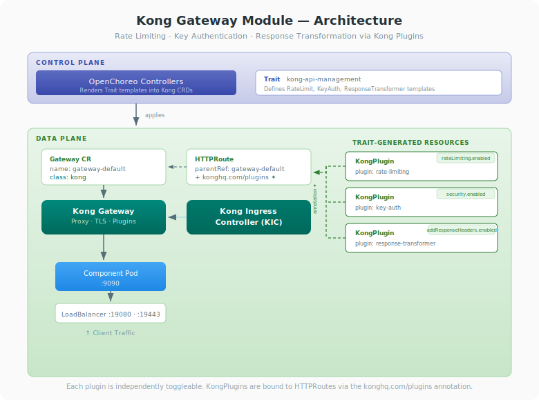

# Kong Gateway Module for OpenChoreo Data Plane

This document provides comprehensive documentation for integrating Kong Gateway as the API gateway in the OpenChoreo data plane, replacing the default kgateway (Envoy-based) implementation.

## Table of Contents

- [Overview](#overview)
- [High-Level Architecture](#high-level-architecture)
- [Installation](#installation)
- [Configuration](#configuration)
- [Maintenance](#maintenance)
- [Customization](#customization)

---

## Overview

OpenChoreo uses the [Kubernetes Gateway API](https://gateway-api.sigs.k8s.io/) as the standard API for exposing component endpoints to public or internal networks. Because the Gateway API is a vendor-neutral Kubernetes standard, the gateway layer is easily pluggable and extensible across vendors — any Gateway API-compliant controller can serve as the ingress layer without changes to the control plane or the OpenChoreo ComponentTypes.

The Kong Gateway module replaces the default kgateway (Envoy) with [Kong Gateway](https://konghq.com/) and the [Kong Kubernetes Ingress Controller (KIC)](https://docs.konghq.com/kubernetes-ingress-controller/latest/), providing advanced API management capabilities such as rate limiting, authentication, request/response transformation, and observability - all through Kubernetes-native CRDs.



### Key Design Decisions

- **Standard Gateway API as the contract**: OpenChoreo components create `HTTPRoute` resources that reference a `Gateway` by name. The gateway implementation is transparent to the control plane.
- **Helm-driven configuration**: The `gatewayClassName` in the data plane Helm chart determines which gateway controller processes the `Gateway` CR and its routes.
- **No control plane changes required**: Switching gateways only requires data plane reconfiguration. The rendering pipeline, endpoint resolution, and release controllers work unchanged.

---

## High-Level Architecture

### Gateway Integration in OpenChoreo

```
┌─────────────────────────────────────────────────────────────┐
│                     CONTROL PLANE                           │
│                                                             │
│   Renders component templates and applies resources         │
│   (Deployment, Service, HTTPRoute) to the data plane        │
│                                                             │
└─────────────────────────────┬───────────────────────────────┘
                              │
                     applies resources
                              │
                              ▼
┌─────────────────────────────────────────────────────────────┐
│                     DATA PLANE                              │
│                                                             │
│              ┌──────────────────────────────┐               │
│              │   Component Resources        │               │
│              │                              │               │
│              │                              │               │
│              │   ┌────────────┐             │               │
│              │   │ Deployment │             │               │
│              │   └────────────┘             │               │
│              │   ┌────────────┐             │               │
│              │   │  Service   │             │               │
│              │   └─────┬──────┘             │               │
│              │         │ backendRef         │               │
│              │   ┌─────┴──────┐             │               │
│              │   │ HTTPRoute  │             │               │
│              │   │            │             │               │
│              │   │ parentRef ─┼────┐        │               │
│              │   └────────────┘    │        │               │
│              └─────────────────────┼────────┘               │
│                                    │                        │
│              ┌─────────────────────┴──────────┐             │
│              │   Gateway CR                   │             │
│              │   name: gateway-default        │             │
│              │   gatewayClassName: kong  ◄──── Configurable │
│              │                                │             │
│              │   listeners:                   │             │
│              │     - http  (port 19080)       │             │
│              │     - https (port 19443, TLS)  │             │
│              └───────────────┬────────────────┘             │
│                              │ watches                      │
│              ┌───────────────┴────────────────┐             │
│              │   Kong Ingress Controller      │             │
│              │   (KIC)                        │             │
│              │                                │             │
│              │   - Watches Gateway, HTTPRoute │             │
│              │   - Translates to Kong config  │             │
│              │   - Pushes to Kong Gateway     │             │
│              └───────────────┬────────────────┘             │
│                              │ configures                   │
│              ┌───────────────┴────────────────┐             │
│              │   Kong Gateway (Proxy)         │             │
│              │                                │             │
│              │   - Processes traffic          │             │
│              │   - TLS termination            │             │
│              │   - Plugin execution           │             │
│              │   - Routes to backends         │             │
│              └───────────────┬────────────────┘             │
│                              │                              │
│                         LoadBalancer                        │
│                         :19080 (HTTP)                       │
│                         :19443 (HTTPS)                      │
└─────────────────────────────────────────────────────────────┘
                              │
                          Client Traffic
```

### Component Breakdown

| Component                                    | Role                                                                                                                           |
| -------------------------------------------- | ------------------------------------------------------------------------------------------------------------------------------ |
| **Kong Kubernetes Ingress Controller (KIC)** | Watches Gateway API resources (Gateway, HTTPRoute) and translates them into Kong proxy configuration                           |
| **Kong Gateway (Proxy)**                     | Processes ingress traffic, terminates TLS, executes plugins (rate limiting, auth, etc.), and routes to backend services        |
| **Gateway CR**                               | Kubernetes Gateway API resource that defines listeners (ports, protocols, TLS). Created by Helm during data plane installation |
| **GatewayClass**                             | Declares that the `konghq.com/kic-gateway-controller` handles Gateway CRs with class `kong`                                    |
| **HTTPRoute**                                | Gateway API route resource. Created by OpenChoreo release pipeline per component. References the Gateway CR via `parentRefs`   |
| **KongPlugin / KongClusterPlugin**           | Kong-specific CRDs for applying API management policies (rate limiting, auth, transforms) to routes via annotations            |

### How Endpoint URLs Are Resolved

The ReleaseBinding controller resolves endpoint URLs by inspecting rendered HTTPRoutes:

1. Extracts `backendRef` port from the HTTPRoute (matches to workload endpoint)
2. Extracts `hostname` from the HTTPRoute spec
3. Looks up the Gateway referenced in `parentRefs`
4. Resolves the HTTPS port from DataPlane/Environment gateway configuration
5. Constructs the invoke URL: `https://<hostname>[:<port>]/<path>`

This resolution is gateway-implementation-agnostic — it only reads standard Gateway API fields.

### Traffic Flow

```
Client
  │
  ▼
LoadBalancer (:19443)
  │
  ▼
Kong Gateway (TLS termination)
  │
  ├─ Match HTTPRoute rules (hostname + path)
  ├─ Execute plugins (rate limit, auth, transform)
  │
  ▼
Service (ClusterIP)
  │
  ▼
Pod (application container)
```

---

## Installation

### Prerequisites

- An existing OpenChoreo deployment, with or without the default kgateway installed
- Helm 3.x
- kubectl configured with cluster access
- cert-manager installed (for TLS certificate management)

### Step 1: Remove kgateway (if currently installed)

If the data plane was previously deployed with kgateway, remove the existing Gateway CR so it can be recreated with the Kong GatewayClass:

```bash
# Delete the existing data plane Gateway CR
kubectl delete gateway gateway-default -n openchoreo-data-plane
```

> **Single cluster mode:** Do not remove the kgateway controller, GatewayClass, or its deployments. The control plane and observability plane gateways depend on kgateway. Only the data plane gateway is pluggable.

In multi-cluster deployments where the data plane runs on a separate cluster, kgateway can be fully removed:

```bash
# Multi-cluster only: remove kgateway entirely from the data plane cluster
kubectl delete gatewayclass kgateway
kubectl delete deployment -l app.kubernetes.io/name=kgateway -n openchoreo-data-plane
kubectl delete svc -l app.kubernetes.io/name=kgateway -n openchoreo-data-plane
```

### Step 2: Install Kong Gateway

```bash
# Add the Kong Helm repository
helm repo add kong https://charts.konghq.com
helm repo update

# Install Kong with Gateway API support
helm install kong kong/ingress \
  --namespace openchoreo-data-plane \
  --set gateway.enabled=true \
  --set gateway.podLabels.openchoreo\.dev/system-component=gateway \
  --set ingressController.enabled=true \
  --set ingressController.installCRDs=true \
  --set ingressController.gatewayAPI.enabled=true \
  --set gateway.env.proxy_listen="0.0.0.0:19080" \
  --set gateway.proxy.type=LoadBalancer \
  --set gateway.proxy.http.enabled=true \
  --set gateway.proxy.http.servicePort=19080 \
  --set gateway.proxy.http.containerPort=19080

# Wait for Kong to be ready
kubectl wait --for=condition=ready pod \
  -l app.kubernetes.io/instance=kong \
  -n openchoreo-data-plane \
  --timeout=300s
```

### Step 3: Create the Kong GatewayClass

```bash
kubectl apply -f - <<EOF
apiVersion: gateway.networking.k8s.io/v1
kind: GatewayClass
metadata:
  name: kong
  annotations:
    konghq.com/gatewayclass-unmanaged: "true"
spec:
  controllerName: konghq.com/kic-gateway-controller
EOF
```

Verify:

```bash
kubectl get gatewayclass kong
# ACCEPTED should be True
```

### Step 4: Deploy the Data Plane with Kong

Install or upgrade the OpenChoreo data plane Helm chart with the Kong `gatewayClassName`:

```bash
helm upgrade openchoreo-data-plane oci://ghcr.io/openchoreo/helm-charts/openchoreo-data-plane \
  --version 0.0.0-latest-dev --namespace openchoreo-data-plane \
  --set gateway.gatewayClassName=kong \
  --set gateway.httpPort=19080 --reuse-values
```

This creates the `gateway-default` Gateway CR referencing the `kong` GatewayClass instead of `kgateway`.

### Step 5: Verify the Installation

```bash
# Check Kong pods
kubectl get pods -n openchoreo-data-plane -l app.kubernetes.io/instance=kong

# Check the Gateway CR status (PROGRAMMED should be True)
kubectl get gateway gateway-default -n openchoreo-data-plane

# Check Gateway listeners
kubectl describe gateway gateway-default -n openchoreo-data-plane
```

Expected pods:

| Pod                 | Role                                                               |
| ------------------- | ------------------------------------------------------------------ |
| `kong-controller-*` | Kong Kubernetes Ingress Controller — watches Gateway API resources |
| `kong-gateway-*`    | Kong Gateway proxy — processes traffic                             |

### Step 6: Grant RBAC for Kong CRDs

The data plane service account needs permissions to manage Kong plugin resources. Create a dedicated ClusterRole and bind it to the data plane service account:

```bash
kubectl apply -f - <<EOF
apiVersion: rbac.authorization.k8s.io/v1
kind: ClusterRole
metadata:
  name: kong-gateway-module
rules:
  - apiGroups: ["configuration.konghq.com"]
    resources: ["kongplugins", "kongclusterplugins", "kongconsumers", "kongcredentials", "tcpingresses", "udpingresses", "kongingresses"]
    verbs: ["*"]
---
apiVersion: rbac.authorization.k8s.io/v1
kind: ClusterRoleBinding
metadata:
  name: kong-gateway-module
roleRef:
  apiGroup: rbac.authorization.k8s.io
  kind: ClusterRole
  name: kong-gateway-module
subjects:
  - kind: ServiceAccount
    name: cluster-agent-dataplane
    namespace: openchoreo-data-plane
EOF
```

> **Note:** Without these permissions, the Release controller will fail to apply KongPlugin resources to the data plane with a "forbidden" error. To remove these permissions later, simply delete the ClusterRole and ClusterRoleBinding:
>
> ```bash
> kubectl delete clusterrole kong-gateway-module
> kubectl delete clusterrolebinding kong-gateway-module
> ```

### Step 7: Allow the Kong Trait on ComponentTypes

To use the `kong-api-management` trait with a ComponentType or ClusterComponentType, add it to the resource's `allowedTraits`. For example, to allow it on the built-in `service` ClusterComponentType:

```bash
kubectl patch clustercomponenttype service --type=json \
  -p '[{"op":"add","path":"/spec/allowedTraits/-","value":{"kind":"ClusterTrait","name":"kong-api-management"}}]'
```

Repeat for any other ComponentTypes or ClusterComponentTypes that should support Kong API management plugins.

### Step 8: Deploy and Invoke the Greeter Service

Deploy the sample greeter service to verify end-to-end traffic flow through Kong, including the `kong-api-management` trait for API management plugins.

**Apply the ComponentType, Trait, Component, and Workload:**

```bash
kubectl apply -f kong-api-management-trait.yaml
```

> **Note:** The greeter service Component uses `componentType: deployment/http-service-with-kong` and attaches the `kong-api-management` trait. See [Kong API Management Trait](#kong-api-management-trait) below for details on available plugins.

**Wait for the deployment to roll out:**

```bash
# Check that the release pipeline has completed
kubectl get componentrelease

# Check the release status
kubectl get release

# Wait for the greeter pod to be ready
kubectl get pods -A
```

**Create a test API key (required when key-auth plugin is enabled):**

The `kong-api-management` trait can enable key-auth on routes. To test, create a KongConsumer with an API key credential in the data plane namespace:

```bash
# Find the data plane namespace for the component
DP_NS=$(kubectl get httproute -A -l openchoreo.dev/component=greeter-service \
  -o jsonpath='{.items[0].metadata.namespace}')

echo "Data plane namespace: $DP_NS"

# Create the API key secret first (must exist before the consumer)
kubectl apply -n "$DP_NS" -f - <<EOF
apiVersion: v1
kind: Secret
metadata:
  name: test-user-key
  labels:
    konghq.com/credential: key-auth
type: Opaque
stringData:
  key: my-test-api-key
EOF

# Create the KongConsumer referencing the key
kubectl apply -n "$DP_NS" -f - <<EOF
apiVersion: configuration.konghq.com/v1
kind: KongConsumer
metadata:
  name: test-user
  annotations:
    kubernetes.io/ingress.class: kong
username: test-user
credentials:
  - test-user-key
EOF
```

> **Important:** The Secret must be created before the KongConsumer. Kong's admission webhook validates that referenced credential secrets exist.

**Invoke the greeter service through Kong:**

```bash
curl http://development-default.openchoreoapis.localhost:19080/greeter-service/greeter/greet\?name\=OpenChoreo -H "apikey: my-test-api-key" -v

* Host development-default.openchoreoapis.localhost:19080 was resolved.
* IPv6: ::1
* IPv4: 127.0.0.1
*   Trying [::1]:19080...
* connect to ::1 port 19080 from ::1 port 60030 failed: Connection refused
*   Trying 127.0.0.1:19080...
* Connected to development-default.openchoreoapis.localhost (127.0.0.1) port 19080
> GET /greeter-service/greeter/greet?name=OpenChoreo HTTP/1.1
> Host: development-default.openchoreoapis.localhost:19080
> User-Agent: curl/8.7.1
> Accept: */*
> apikey: my-test-api-key
>
* Request completely sent off
< HTTP/1.1 200 OK
< Content-Type: text/plain; charset=utf-8
< Content-Length: 19
< Connection: keep-alive
< X-RateLimit-Remaining-Minute: 596
< X-RateLimit-Limit-Minute: 600
< RateLimit-Remaining: 596
< RateLimit-Reset: 28
< RateLimit-Limit: 600
< Date: Wed, 18 Feb 2026 10:06:32 GMT
< Server: kong/3.9.1
< X-Kong-Upstream-Latency: 1
< X-Kong-Proxy-Latency: 1
< Via: 1.1 kong/3.9.1
< X-Kong-Request-Id: 587d07393b6bad28452c127e85ba9e06
<
Hello, OpenChoreo!
* Connection #0 to host development-default.openchoreoapis.localhost left intact
```

Expected response:

```
Hello, OpenChoreo!
```

The response headers will include Kong proxy metadata (`server: kong/3.9.1`, `x-kong-upstream-latency`, etc.) and any custom headers added by the `response-transformer` plugin.

**Cleanup:**

```bash
kubectl delete component greeter-service -n default
kubectl delete workload greeter-service-workload -n default
```

### Kong API Management Trait

The `kong-api-management` trait provides declarative API management for components routed through Kong. It creates KongPlugin CRDs and patches the HTTPRoute annotations automatically.

#### Trait Schema

**Parameters (static across environments):**

| Parameter                    | Type            | Default      | Description                                                   |
| ---------------------------- | --------------- | ------------ | ------------------------------------------------------------- |
| `rateLimiting.enabled`       | boolean         | `true`       | Enable rate limiting plugin                                   |
| `rateLimiting.policy`        | string          | `"local"`    | Rate limiting policy (`local` or `redis`)                     |
| `security.enabled`           | boolean         | `false`      | Enable authentication plugin                                  |
| `security.authType`          | string          | `"key-auth"` | Kong auth plugin name (`key-auth`, `basic-auth`, `jwt`, etc.) |
| `addResponseHeaders.enabled` | boolean         | `false`      | Enable response header injection                              |
| `addResponseHeaders.headers` | array\<string\> | `[]`         | Headers to add to responses (format: `"Header-Name:value"`)   |

**Environment Overrides (configurable per environment):**

| Override                         | Type    | Default | Description                     |
| -------------------------------- | ------- | ------- | ------------------------------- |
| `rateLimiting.requestsPerMinute` | integer | `60`    | Rate limit threshold per minute |

#### How It Works

The trait uses OpenChoreo's template rendering pipeline to:

1. **Create KongPlugin CRDs** — one for each enabled plugin (rate-limiting, auth, response-transformer). Each plugin is conditionally created based on its `enabled` flag.

2. **Patch the HTTPRoute** — adds a `konghq.com/plugins` annotation listing the enabled plugin names, which Kong's Ingress Controller uses to bind plugins to the route.

#### Example Usage

```yaml
apiVersion: openchoreo.dev/v1alpha1
kind: Component
metadata:
  name: my-service
  namespace: default
spec:
  owner:
    projectName: default
  autoDeploy: true
  componentType: deployment/http-service-with-kong
  parameters:
    port: 8080
    replicas: 1
  traits:
    - instanceName: my-api
      name: kong-api-management
      parameters:
        rateLimiting:
          enabled: true
          policy: local
        security:
          enabled: true
          authType: key-auth
        addResponseHeaders:
          enabled: true
          headers:
            - "X-Gateway:Kong"
            - "X-Managed-By:OpenChoreo"
```

This produces three KongPlugin resources and an HTTPRoute annotated with all three plugin names. The rate limit can be overridden per environment via ReleaseBinding `traitOverrides`:

```yaml
traitOverrides:
  my-api:
    rateLimiting:
      requestsPerMinute: 600 # Higher limit for production
```

---

## Configuration

### Helm Values Reference

The following values control gateway behavior in the data plane Helm chart:

| Value                         | Type   | Default                        | Description                                                              |
| ----------------------------- | ------ | ------------------------------ | ------------------------------------------------------------------------ |
| `gateway.gatewayClassName`    | string | `"kgateway"`                   | GatewayClass name referenced by the Gateway CR. Set to `"kong"` for Kong |
| `gateway.httpPort`            | int    | `9080`                         | HTTP listener port                                                       |
| `gateway.httpsPort`           | int    | `9443`                         | HTTPS listener port                                                      |
| `gateway.tls.hostname`        | string | `"*.openchoreoapis.localhost"` | Wildcard hostname for TLS certificate                                    |
| `gateway.tls.certificateRefs` | string | `"openchoreo-gateway-tls"`     | Secret name for the TLS certificate                                      |
| `gateway.infrastructure`      | object | `{}`                           | Cloud provider load balancer annotations                                 |

### ClusterDataPlane/DataPlane CR Gateway Configuration

After the Kong Gateway CR is created, register it as an ingress gateway on the ClusterDataPlane/DataPlane CR so the control plane knows how to resolve endpoint URLs and route traffic.

The gateway configuration uses `spec.gateway.ingress` with named gateway slots (`external`, `internal`, etc.). Each slot references a Gateway CR and specifies the HTTP listener details:

```bash
kubectl patch clusterdataplane default --type merge -p '{
  "spec": {
    "gateway": {
      "ingress": {
        "external": {
          "name": "gateway-default",
          "namespace": "openchoreo-data-plane",
          "http": {
            "host": "openchoreoapis.localhost",
            "listenerName": "http",
            "port": 19080
          }
        }
      }
    }
  }
}'
```

| Field               | Description                                                                                          |
| ------------------- | ---------------------------------------------------------------------------------------------------- |
| `name`              | Name of the Gateway CR. Must match the Gateway resource created in the data plane                    |
| `namespace`         | Namespace where the Gateway CR is deployed                                                           |
| `http.host`         | Hostname used for routing. For ClusterIP gateways, use `<service-name>.<namespace>` (in-cluster DNS) |
| `http.listenerName` | Named listener on the Gateway CR (e.g., `http`)                                                      |
| `http.port`         | Port the gateway service listens on                                                                  |

> **Note:** For internal (ClusterIP) gateways, set `http.host` to the in-cluster DNS name of the gateway service (e.g., `gateway-internal.openchoreo-data-plane`). For LoadBalancer gateways, use the external hostname or IP assigned by the cloud provider.

### Environment-Level Overrides

Environments can override the ClusterDataPlane/DataPlane gateway configuration with dedicated gateway resources. This is useful when different environments (e.g., production) need their own gateway with separate listeners, ports, or hostnames.

**1. Create a dedicated Gateway CR for the environment:**

```yaml
apiVersion: gateway.networking.k8s.io/v1
kind: Gateway
metadata:
  name: gateway-production
  namespace: openchoreo-data-plane
  labels:
    app.kubernetes.io/component: gateway
    app.kubernetes.io/part-of: openchoreo
spec:
  gatewayClassName: kong
  listeners:
    - name: http
      port: 19081
      protocol: HTTP
      allowedRoutes:
        namespaces:
          from: All
```

**2. Patch the Environment CR to reference the dedicated gateway:**

```bash
kubectl patch environment production -n default --type merge -p '{
  "spec": {
    "gateway": {
      "ingress": {
        "external": {
          "name": "gateway-production",
          "namespace": "openchoreo-data-plane",
          "http": {
            "host": "openchoreoapis.localhost",
            "listenerName": "http",
            "port": 19081
          }
        }
      }
    }
  }
}'
```

When gateway configuration is set on an Environment, it takes full precedence over the ClusterDataPlane/DataPlane gateway config for that environment.

### Port Configuration

Kong must listen on the same ports that the Gateway CR declares. The port mapping must be consistent across:

| Layer                    | HTTP  | HTTPS | Configured Via                                                       |
| ------------------------ | ----- | ----- | -------------------------------------------------------------------- |
| Kong `KONG_PROXY_LISTEN` | 19080 | 19443 | Kong Helm `--set gateway.env.proxy_listen`                           |
| Kong Service ports       | 19080 | 19443 | Kong Helm `--set gateway.proxy.http.servicePort` / `tls.servicePort` |
| Gateway CR listeners     | 19080 | 19443 | Data plane Helm `gateway.httpPort` / `gateway.httpsPort`             |
| DataPlane CR             | 19080 | 19443 | `spec.gateway.ingress.external.http.port`                            |

A mismatch at any layer will cause listener errors or broken endpoint URLs.

### Kong-Specific Plugin Configuration

Kong plugins are applied to HTTPRoutes via annotations. Define plugins as `KongPlugin` CRDs and reference them on the route:

```yaml
apiVersion: configuration.konghq.com/v1
kind: KongPlugin
metadata:
  name: rate-limit-5rpm
  namespace: <component-namespace>
config:
  minute: 5
  policy: local
plugin: rate-limiting
```

Apply to an HTTPRoute:

```yaml
annotations:
  konghq.com/plugins: rate-limit-5rpm
```

For cluster-wide plugins, use `KongClusterPlugin` with `labels: { global: "true" }`.

---

## Maintenance

### Monitoring Kong Health

```bash
# Check Kong pod status
kubectl get pods -n openchoreo-data-plane -l app.kubernetes.io/instance=kong

# Check Gateway CR programmed status
kubectl get gateway gateway-default -n openchoreo-data-plane

# View KIC controller logs
kubectl logs -n openchoreo-data-plane -l app.kubernetes.io/component=controller-manager,app.kubernetes.io/instance=kong -f

# View Kong proxy logs
kubectl logs -n openchoreo-data-plane -l app.kubernetes.io/component=app,app.kubernetes.io/instance=kong -f
```

### Accessing the Kong Admin API

The Admin API provides runtime visibility into Kong's configuration:

```bash
# Port-forward to Admin API
kubectl port-forward -n openchoreo-data-plane svc/kong-gateway-admin 8444:8444 &

# List configured routes
curl -k https://localhost:8444/routes

# List configured services
curl -k https://localhost:8444/services

# List active plugins
curl -k https://localhost:8444/plugins

# Check Kong status
curl -k https://localhost:8444/status
```

### Upgrading Kong

```bash
# Update Helm repo
helm repo update kong

# Upgrade Kong release
helm upgrade kong kong/ingress \
  --namespace openchoreo-data-plane \
  --reuse-values

# Verify pods are restarted
kubectl rollout status deployment/kong-gateway -n openchoreo-data-plane
kubectl rollout status deployment/kong-controller -n openchoreo-data-plane
```

### TLS Certificate Renewal

If using cert-manager, certificates are renewed automatically. To check certificate status:

```bash
# Check certificate status
kubectl get certificate -n openchoreo-data-plane

# Check secret expiry
kubectl get secret openchoreo-gateway-tls -n openchoreo-data-plane -o jsonpath='{.metadata.annotations}'
```

For manual certificate rotation:

```bash
# Delete the secret to trigger re-issuance (cert-manager)
kubectl delete secret openchoreo-gateway-tls -n openchoreo-data-plane

# Or update the secret directly
kubectl create secret tls openchoreo-gateway-tls \
  --cert=tls.crt --key=tls.key \
  -n openchoreo-data-plane --dry-run=client -o yaml | kubectl apply -f -
```

### Troubleshooting

**Gateway not PROGRAMMED**

```bash
kubectl describe gateway gateway-default -n openchoreo-data-plane
```

Common causes:

- Kong not listening on the ports declared in Gateway listeners. Verify `KONG_PROXY_LISTEN` matches `gateway.httpPort`/`gateway.httpsPort`.
- GatewayClass not found or not accepted. Verify `kubectl get gatewayclass kong`.
- KIC controller not running. Check `kubectl get pods -l app.kubernetes.io/component=controller-manager`.

**HTTPRoutes not taking effect**

```bash
# Check HTTPRoute status
kubectl get httproute -A

# Describe a specific route
kubectl describe httproute <name> -n <namespace>
```

Common causes:

- HTTPRoute `parentRef` name/namespace does not match the Gateway CR.
- Cross-namespace routing not allowed (Gateway must have `allowedRoutes.namespaces.from: All`).
- Backend service not found or port mismatch.

**Endpoint URLs not resolving**

Verify the DataPlane CR gateway config matches the actual Gateway CR:

```bash
kubectl get dataplane default -o yaml | grep -A 10 gateway
```

Ensure `publicGatewayName` and `publicGatewayNamespace` match the Gateway CR's name and namespace.

---

## Customization

### Adding Kong Plugins to ComponentType Templates

To apply Kong plugins to all instances of a ComponentType, add annotations in the HTTPRoute template:

```yaml
# In ComponentType spec.resourceTemplates
- id: httproute
  template:
    apiVersion: gateway.networking.k8s.io/v1
    kind: HTTPRoute
    metadata:
      name: ${metadata.name}
      namespace: ${metadata.namespace}
      annotations:
        konghq.com/plugins: rate-limit,request-transform
    spec:
      parentRefs:
        - name: gateway-default
          namespace: openchoreo-data-plane
      hostnames:
        - ${environment.publicVirtualHost}
      rules:
        - backendRefs:
            - name: ${metadata.name}
              port: 80
```

> **Note:** Kong plugin annotations on HTTPRoutes create a dependency on Kong as the gateway implementation. Standard Gateway API fields remain portable.

### Custom Listener Ports

To use non-default ports (e.g., standard 80/443):

1. Configure Kong to listen on the desired ports:

```bash
--set gateway.env.proxy_listen="0.0.0.0:80\, 0.0.0.0:443 http2 ssl"
--set gateway.proxy.http.servicePort=80
--set gateway.proxy.http.containerPort=80
--set gateway.proxy.tls.servicePort=443
--set gateway.proxy.tls.containerPort=443
```

2. Update the data plane Helm values:

```bash
--set gateway.httpPort=80
--set gateway.httpsPort=443
```

3. Update the DataPlane CR:

```yaml
spec:
  gateway:
    publicHTTPPort: 80
    publicHTTPSPort: 443
```

### Cloud Provider Load Balancer Configuration

Use the `gateway.infrastructure` value to add cloud-specific annotations to the Gateway's generated Service:

```yaml
gateway:
  infrastructure:
    annotations:
      service.beta.kubernetes.io/aws-load-balancer-type: "external"
      service.beta.kubernetes.io/aws-load-balancer-nlb-target-type: "ip"
      service.beta.kubernetes.io/aws-load-balancer-scheme: "internet-facing"
```

### Scaling Kong for Production

```bash
# Scale the Kong proxy
kubectl scale deployment kong-gateway -n openchoreo-data-plane --replicas=3

# Scale the KIC controller (active-passive, single replica recommended)
kubectl scale deployment kong-controller -n openchoreo-data-plane --replicas=1
```

For production Helm values:

```yaml
# kong-production-values.yaml
gateway:
  replicaCount: 3
  resources:
    requests:
      cpu: "500m"
      memory: "512Mi"
    limits:
      cpu: "2"
      memory: "2Gi"
```

### Enabling Kong Enterprise Features

For production deployments requiring advanced API management:

- **Kong Manager UI**: Access via `kong-gateway-manager` service for visual route and plugin management
- **Developer Portal**: Requires Kong Enterprise license
- **RBAC / Workspaces**: Requires Kong Enterprise license
- **Vitals / Analytics**: Requires Kong Enterprise license

See the [Kong Enterprise documentation](https://docs.konghq.com/gateway/latest/) for license setup.

### Connecting to Kong Konnect

[Kong Konnect](https://cloud.konghq.com) is Kong's SaaS control plane that provides centralized visibility, analytics, and management for Kong Gateway instances. Connecting KIC to Konnect gives you a web UI to view routes, services, plugins, and monitor traffic — while Kubernetes resources remain the source of truth for configuration.

> **Note:** The Konnect dashboard is read-only for KIC-managed gateways. All configuration changes must be made via kubectl or Helm.

#### 1. Create a Konnect Control Plane

Log in to [Kong Konnect](https://cloud.konghq.com) and create a KIC control plane via the API:

```bash
export KONNECT_TOKEN="<your-konnect-personal-access-token>"

CONTROL_PLANE_DETAILS=$(curl -X POST "https://us.api.konghq.com/v2/control-planes" \
  --no-progress-meter --fail-with-body \
  -H "Authorization: Bearer $KONNECT_TOKEN" \
  --json '{
    "name": "openchoreo-data-plane",
    "cluster_type": "CLUSTER_TYPE_K8S_INGRESS_CONTROLLER"
  }')

CONTROL_PLANE_ID=$(echo $CONTROL_PLANE_DETAILS | jq -r .id)
CONTROL_PLANE_TELEMETRY=$(echo $CONTROL_PLANE_DETAILS | jq -r '.config.telemetry_endpoint | sub("https://";"")')

echo "Control Plane ID: $CONTROL_PLANE_ID"
echo "Telemetry Endpoint: $CONTROL_PLANE_TELEMETRY"
```

#### 2. Generate and Upload TLS Certificates

KIC authenticates to Konnect using mTLS. Generate a certificate and upload it:

```bash
openssl req -new -x509 -nodes -newkey rsa:2048 \
  -subj "/CN=kongdp/C=US" -keyout ./tls.key -out ./tls.crt

# Upload the certificate to Konnect
CERT=$(awk 'NF {sub(/\r/, ""); printf "%s\\n",$0;}' tls.crt)
curl -X POST "https://us.api.konghq.com/v2/control-planes/$CONTROL_PLANE_ID/dp-client-certificates" \
  -H "Authorization: Bearer $KONNECT_TOKEN" \
  --json '{"cert": "'"$CERT"'"}'
```

#### 3. Create Kubernetes Secret

Store the TLS certificate in the data plane namespace:

```bash
kubectl create secret tls konnect-client-tls \
  -n openchoreo-data-plane \
  --cert=./tls.crt --key=./tls.key
```

#### 4. Upgrade Kong with Konnect Configuration

Upgrade the Kong Helm release with Konnect connectivity settings:

```bash
helm upgrade kong kong/ingress \
  --namespace openchoreo-data-plane \
  --reuse-values \
  --set controller.ingressController.image.tag=3.5 \
  --set controller.ingressController.env.feature_gates="FillIDs=true" \
  --set controller.ingressController.konnect.license.enabled=true \
  --set controller.ingressController.konnect.enabled=true \
  --set controller.ingressController.konnect.controlPlaneID="$CONTROL_PLANE_ID" \
  --set controller.ingressController.konnect.tlsClientCertSecretName=konnect-client-tls \
  --set controller.ingressController.konnect.apiHostname="us.kic.api.konghq.com" \
  --set gateway.image.repository=kong/kong-gateway \
  --set gateway.image.tag="3.13" \
  --set gateway.env.konnect_mode="on" \
  --set gateway.env.vitals="off" \
  --set gateway.env.cluster_mtls=pki \
  --set gateway.env.cluster_telemetry_endpoint="$CONTROL_PLANE_TELEMETRY:443" \
  --set gateway.env.cluster_telemetry_server_name="$CONTROL_PLANE_TELEMETRY" \
  --set gateway.env.cluster_cert="/etc/secrets/konnect-client-tls/tls.crt" \
  --set gateway.env.cluster_cert_key="/etc/secrets/konnect-client-tls/tls.key" \
  --set gateway.env.lua_ssl_trusted_certificate=system \
  --set 'gateway.secretVolumes[0]=konnect-client-tls'
```

> **Note:** For EU region, use `eu.kic.api.konghq.com` for `apiHostname` and the EU API endpoint (`eu.api.konghq.com`) for control plane creation.

#### 5. Verify Konnect Connection

Check that KIC has synced to Konnect:

```bash
kubectl logs -n openchoreo-data-plane -l app.kubernetes.io/name=controller --tail=20 | grep konnect
```

Look for `Successfully synced configuration to Konnect` in the logs.

You can also list routes via the Konnect API:

```bash
curl -s -H "Authorization: Bearer $KONNECT_TOKEN" \
  "https://us.api.konghq.com/v2/control-planes/$CONTROL_PLANE_ID/core-entities/routes" | jq
```

Or view them in the Konnect UI: **Gateway Manager → your control plane → Routes**.
