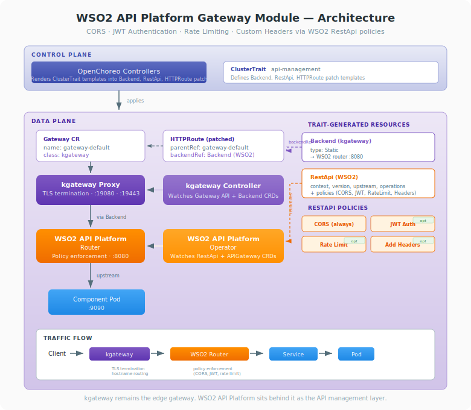

# WSO2 API Platform Gateway Module for OpenChoreo Data Plane

This document provides comprehensive documentation for integrating WSO2 API Platform for Kubernetes as the API management layer in the OpenChoreo data plane, running alongside the default kgateway (Envoy-based) implementation.

## Table of Contents

- [Overview](#overview)
- [High-Level Architecture](#high-level-architecture)
- [Installation](#installation)
- [Configuration](#configuration)
- [Maintenance](#maintenance)
- [Customization](#customization)

---

## Overview

OpenChoreo uses the [Kubernetes Gateway API](https://gateway-api.sigs.k8s.io/) as the standard API for exposing component endpoints to public or internal networks. The [WSO2 API Platform](https://github.com/wso2/api-platform) provides enterprise API management capabilities — including rate limiting, authentication, and API lifecycle management — through its own CRDs (`RestApi`, `APIGateway`).

Unlike Kong, Traefik, or Envoy Gateway, **WSO2 API Platform does not implement the Kubernetes Gateway API**. It cannot serve as a drop-in replacement for kgateway. Instead, this module deploys WSO2 API Platform alongside the default kgateway and routes traffic through the WSO2 router by replacing the HTTPRoute's `backendRef` with a kgateway `Backend` resource pointing to the WSO2 API Platform router.

### Key Design Decisions

- **kgateway remains the Gateway API controller**: The default kgateway handles all `Gateway` and `HTTPRoute` resources. WSO2 API Platform does not replace kgateway — it sits behind it as an API management layer.
- **Traffic routing via kgateway Backend**: The trait creates a kgateway `Backend` (static type) pointing to the WSO2 API Platform router, and patches the HTTPRoute's `backendRef` to route through the WSO2 router instead of directly to the component's Service.
- **WSO2 RestApi CRD for API management**: The trait creates a `RestApi` resource that defines the API's context path, version, upstream, operations, and policies. WSO2's operator reconciles this into its internal gateway configuration.
- **No control plane changes required**: The rendering pipeline, endpoint resolution, and release controllers work unchanged. Only a ClusterTrait is added to inject the WSO2 resources.
- **Separate Helm installation**: The WSO2 API Platform operator and gateway are installed via their own Helm charts, independent of the OpenChoreo data plane chart.

---

## High-Level Architecture



### Gateway Integration in OpenChoreo

```
┌─────────────────────────────────────────────────────────────┐
│                     CONTROL PLANE                           │
│                                                             │
│   Renders component templates and applies resources         │
│   (Deployment, Service, HTTPRoute, RestApi, Backend)        │
│   to the data plane                                         │
│                                                             │
└─────────────────────────┬───────────────────────────────────┘
                          │
                 applies resources
                          │
                          ▼
┌─────────────────────────────────────────────────────────────┐
│                     DATA PLANE                              │
│                                                             │
│              ┌──────────────────────────────┐               │
│              │   Component Resources        │               │
│              │                              │               │
│              │   ┌────────────┐             │               │
│              │   │ Deployment │             │               │
│              │   └────────────┘             │               │
│              │   ┌────────────┐             │               │
│              │   │  Service   │             │               │
│              │   └─────┬──────┘             │               │
│              │         │ upstream           │               │
│              │   ┌─────┴──────┐             │               │
│              │   │  RestApi   │─────────────┼───────┐       │
│              │   │  (WSO2)    │             │       │       │
│              │   └────────────┘             │       │       │
│              │                              │       │       │
│              │   ┌────────────┐             │       │       │
│              │   │  Backend   │─────────┐   │       │       │
│              │   │(kgateway)  │         │   │       │       │
│              │   └────────────┘         │   │       │       │
│              │         ▲                │   │       │       │
│              │         │ backendRef     │   │       │       │
│              │   ┌─────┴──────┐         │   │       │       │
│              │   │ HTTPRoute  │         │   │       │       │
│              │   │ (patched)  │         │   │       │       │
│              │   │ parentRef ─┼────┐    │   │       │       │
│              │   └────────────┘    │    │   │       │       │
│              └──────────────────── ┼─── ┼───┘       │       │
│                                    │    │           │       │
│              ┌─────────────────────┴─── ┴─────────┐ │       │
│              │   Gateway CR                       │ │       │
│              │   name: gateway-default            │ │       │
│              │   gatewayClassName: kgateway       │ │       │
│              │                                    │ │       │
│              │   listeners:                       │ │       │
│              │     - http  (port 19080)           │ │       │
│              │     - https (port 19443, TLS)      │ │       │
│              └───────────────┬─────────────────── ┘ │       │
│                              │ watches              │       │
│              ┌───────────────┴───────────────────┐  │       │
│              │   kgateway Controller             │  │       │
│              │                                   │  │       │
│              │   - Watches Gateway, HTTPRoute    │  │       │
│              │   - Resolves Backend refs         │  │       │
│              │   - Routes to WSO2 router         │  │       │
│              └───────────────┬───────────────────┘  │       │
│                              │                      │       │
│                              ▼                      │       │
│              ┌───────────────────────────────────┐  │       │
│              │   WSO2 API Platform Router        │◄─┘       │
│              │                                   │          │
│              │   - Applies API policies          │          │
│              │   - Rate limiting                 │          │
│              │   - Authentication                │          │
│              │   - Routes to upstream Service    │◄─────────┘
│              └───────────────┬───────────────────┘
│                              │
│                         LoadBalancer
│                         :19080 (HTTP)
│                         :19443 (HTTPS)
└─────────────────────────────────────────────────────────────┘
                              │
                          Client Traffic
```

### Component Breakdown

| Component                      | Role                                                                                                                            |
| ------------------------------ | ------------------------------------------------------------------------------------------------------------------------------- |
| **kgateway Controller**        | Watches Gateway API resources (Gateway, HTTPRoute, Backend), routes traffic. Remains the Gateway API implementation             |
| **WSO2 API Platform Operator** | Watches `RestApi` and `APIGateway` (WSO2) CRDs, reconciles API configurations into the WSO2 router                              |
| **WSO2 API Platform Router**   | Processes API traffic, enforces policies (rate limiting, auth), and routes to upstream backend services                         |
| **Gateway CR**                 | Kubernetes Gateway API resource that defines listeners (ports, protocols, TLS). Managed by kgateway as usual                    |
| **HTTPRoute**                  | Gateway API route resource. Created by OpenChoreo release pipeline per component. Patched by the trait to route via WSO2 router |
| **Backend (kgateway)**         | kgateway-specific CRD pointing to the WSO2 API Platform router as a static upstream. Created by the trait                       |
| **RestApi (WSO2)**             | WSO2 API Platform CRD defining API context, version, upstream service, operations, and policies. Created by the trait           |

### How Endpoint URLs Are Resolved

The ReleaseBinding controller resolves endpoint URLs by inspecting rendered HTTPRoutes:

1. Extracts `backendRef` port from the HTTPRoute (matches to workload endpoint)
2. Extracts `hostname` from the HTTPRoute spec
3. Looks up the Gateway referenced in `parentRefs`
4. Resolves the HTTPS port from DataPlane/Environment gateway configuration
5. Constructs the invoke URL: `https://<hostname>[:<port>]/<path>`

This resolution is gateway-implementation-agnostic — it only reads standard Gateway API fields. The HTTPRoute's `backendRef` is replaced to point to the kgateway Backend (WSO2 router), but the URL resolution logic remains unchanged.

### Traffic Flow

```
Client
  │
  ▼
LoadBalancer (:19443)
  │
  ▼
kgateway (TLS termination)
  │
  ├─ Match HTTPRoute rules (hostname + path)
  ├─ Resolve Backend ref → WSO2 router
  │
  ▼
WSO2 API Platform Router (:8080)
  │
  ├─ Match RestApi context path
  ├─ Apply policies (rate limiting, auth)
  ├─ Route to upstream Service
  │
  ▼
Service (ClusterIP)
  │
  ▼
Pod (application container)
```

---

## Installation

### Prerequisites

- An existing OpenChoreo deployment with kgateway installed (default)
- Helm 3.x
- kubectl configured with cluster access

### Step 1: Install the WSO2 API Platform Operator

Install the WSO2 API Platform gateway operator using its Helm chart. The operator watches `RestApi` and `APIGateway` (WSO2) CRDs, and deploys the gateway components (router, policy engine) based on the `gateway.helm.*` values:

```bash
helm install api-platform-operator \
    oci://ghcr.io/wso2/api-platform/helm-charts/gateway-operator \
    --version 0.4.0 \
    --namespace openchoreo-data-plane \
    --set gateway.helm.chartName="oci://ghcr.io/wso2/api-platform/helm-charts/gateway" \
    --set gateway.helm.chartVersion="0.9.0" \
    --set gateway.values.gateway.controller.image.tag="0.9.0" \
    --set gateway.values.gateway.router.image.tag="0.9.0" \
    --set gateway.values.gateway.policyEngine.image.tag="0.9.0"
```

Wait for the operator pod to be ready:

```bash
kubectl wait --for=condition=ready pod \
  -l app.kubernetes.io/name=gateway-operator \
  -n openchoreo-data-plane \
  --timeout=300s
```

### Step 2: Apply the Gateway Configuration and Create the WSO2 APIGateway CR

The operator is now running but no gateway instance exists yet. First, apply the gateway configuration ConfigMap that defines the gateway's runtime settings (router, policy engine, TLS, logging, etc.):

```bash
kubectl apply -f gateway-configuration.yaml
```

Then, create an `APIGateway` CR (WSO2's CRD — `apigateways.gateway.api-platform.wso2.com`, not the Kubernetes Gateway API `Gateway`) to instruct the operator to deploy the gateway components (router, policy engine). The CR references the ConfigMap created above via `configRef`:

```bash
kubectl apply -n openchoreo-data-plane -f - <<EOF
apiVersion: gateway.api-platform.wso2.com/v1alpha1
kind: APIGateway
metadata:
  name: api-platform-default
spec:
  apiSelector:
    scope: Cluster

  infrastructure:
    replicas: 1
    resources:
      requests:
        cpu: "500m"
        memory: "1Gi"
      limits:
        cpu: "2"
        memory: "4Gi"

  storage:
    type: sqlite
  configRef:
    name: api-platform-operator-gateway-values
EOF
```

**APIGateway spec fields:**

| Field            | Required | Description                                                                                                          |
| ---------------- | -------- | -------------------------------------------------------------------------------------------------------------------- |
| `apiSelector`    | Yes      | Determines API selection strategy. `scope: Cluster` selects RestApis across all namespaces                           |
| `infrastructure` | No       | Deployment configuration: `replicas`, `resources`, `image`, `routerImage`, `nodeSelector`, `affinity`, `tolerations` |
| `storage`        | No       | Storage backend: `sqlite` (default), `postgres`, or `mysql`. For postgres/mysql, set `connectionSecretRef`           |
| `configRef`      | No       | References a ConfigMap (key `values.yaml`) with custom Helm values. Must match `gateway.configRefName` from Step 1   |
| `controlPlane`   | No       | Control plane connection settings (`host`, `tls`, `tokenSecretRef`) for managed deployments                          |

The operator reconciles this CR and deploys the gateway Helm chart (`oci://ghcr.io/wso2/api-platform/helm-charts/gateway` version `0.9.0`) with the referenced ConfigMap values.

Wait for the gateway pods to be ready:

```bash
kubectl wait --for=condition=ready pod \
  -l app.kubernetes.io/instance=api-platform-default-gateway \
  -n openchoreo-data-plane \
  --timeout=300s
```

### Step 3: Verify the Installation

Confirm all WSO2 API Platform components are operational:

```bash
kubectl get pods -n openchoreo-data-plane \
  --selector="app.kubernetes.io/instance=api-platform-default-gateway"
```

Expected pods:

| Pod                                              | Role                                                                                              |
| ------------------------------------------------ | ------------------------------------------------------------------------------------------------- |
| `api-platform-default-gateway-controller-*`      | WSO2 API Platform controller — manages API configurations, xDS server, REST API                   |
| `api-platform-default-gateway-gateway-runtime-*` | WSO2 API Platform gateway runtime — combines the router (Envoy) and policy engine in a single pod |

### Step 4: Grant RBAC for WSO2 API Platform CRDs

The data plane service account needs permissions to manage WSO2 API Platform and kgateway Backend resources. Create a dedicated ClusterRole and bind it to the data plane service account:

```bash
kubectl apply -f - <<EOF
apiVersion: rbac.authorization.k8s.io/v1
kind: ClusterRole
metadata:
  name: wso2-api-platform-gateway-module
rules:
  - apiGroups: ["gateway.api-platform.wso2.com"]
    resources: ["restapis", "apigateways"]
    verbs: ["*"]
  - apiGroups: ["gateway.kgateway.dev"]
    resources: ["backends"]
    verbs: ["*"]
---
apiVersion: rbac.authorization.k8s.io/v1
kind: ClusterRoleBinding
metadata:
  name: wso2-api-platform-gateway-module
roleRef:
  apiGroup: rbac.authorization.k8s.io
  kind: ClusterRole
  name: wso2-api-platform-gateway-module
subjects:
  - kind: ServiceAccount
    name: cluster-agent-dataplane
    namespace: openchoreo-data-plane
EOF
```

> **Note:** Without these permissions, the Release controller will fail to apply RestApi and Backend resources to the data plane with a "forbidden" error. To remove these permissions later, simply delete the ClusterRole and ClusterRoleBinding:
>
> ```bash
> kubectl delete clusterrole wso2-api-platform-gateway-module
> kubectl delete clusterrolebinding wso2-api-platform-gateway-module
> ```

### Step 5: Deploy and Invoke the Greeting Service

Deploy the sample greeting service to verify end-to-end traffic flow through WSO2 API Platform, including the `api-management` ClusterTrait.

**Apply the ClusterTrait:**

```bash
kubectl apply -f wso2-api-platform-api-configuration-trait.yaml
```

**Update the ClusterComponentType to allow the trait:**

The `api-management` trait must be listed in the ComponentType's `allowedTraits` before components can use it. Patch the `ClusterComponentType/deployment/service` (or whichever ComponentType your components use) to add the trait:

```bash
kubectl patch clustercomponenttype service --type='json' -p='[
  {"op": "add", "path": "/spec/allowedTraits/-", "value": {"name": "api-management", "kind": "ClusterTrait"}}
]'
```

Alternatively, edit the ComponentType YAML directly and re-apply it:

```yaml
spec:
  allowedTraits:
    - name: api-configuration
    - name: observability-alert-rule
    - name: api-management # Add this line
      kind: ClusterTrait # Required since it's a ClusterTrait
```

> **Note:** Without this entry, the Component webhook will reject any Component that references the `api-management` trait with a validation error.

**Apply the Component and Workload:**

```bash
kubectl apply -f component.yaml
```

> **Note:** The greeting service Component uses `componentType: ClusterComponentType/deployment/service` and attaches the `api-management` ClusterTrait. The trait automatically derives all API values (displayName, context, version, upstream URL, operations) from the component metadata and workload endpoints. Optional policies (JWT auth, rate limiting, custom headers) can be enabled via trait parameters.

**Wait for the deployment to roll out:**

```bash
# Check that the release pipeline has completed
kubectl get componentrelease

# Check the release status
kubectl get release

# Wait for the greeting pod to be ready
kubectl get pods -A

# Verify RestApi resources are created
kubectl get restapi -A

# Verify Backend resources are created
kubectl get backend.gateway.kgateway.dev -A
```

**Invoke the greeting service through the WSO2 API Platform:**

```bash
curl http://development-default.openchoreoapis.localhost:19080/greeting-service-http/greet?name=OpenChoreo -v
```

Expected response:

```
Hello, OpenChoreo!
```

**Cleanup:**

```bash
kubectl delete component greeting-service -n default
kubectl delete workload greeting-service-workload -n default
```

### API Management ClusterTrait

The `api-management` ClusterTrait provides declarative API management for components routed through WSO2 API Platform. It creates a kgateway `Backend` (static) pointing to the WSO2 router, a WSO2 `RestApi` resource defining the API, and patches the HTTPRoute to route traffic through the WSO2 router.

#### Derived Values (automatic)

The following values are automatically derived from component metadata and workload endpoints — they are not user-configurable:

| Value         | Pattern                                                      | Example                                 |
| ------------- | ------------------------------------------------------------ | --------------------------------------- |
| `displayName` | `<environment>-<namespace>-<componentName>`                  | `development-default-greeting-service`  |
| `context`     | `/<environment>-<namespace>-<componentName>`                 | `/development-default-greeting-service` |
| `version`     | `v1.0`                                                       | `v1.0`                                  |
| `upstream`    | `http://<componentName>.<namespace>:<first endpoint port>`   | `http://greeting-service.default:9090`  |
| `operations`  | All methods (GET, POST, PUT, PATCH, DELETE, OPTIONS) on `/*` | —                                       |

#### Trait Parameters

Optional policies that can be enabled via trait parameters (all disabled by default):

| Parameter    | Type   | Description                                                                                                                                                                                                                                 |
| ------------ | ------ | ------------------------------------------------------------------------------------------------------------------------------------------------------------------------------------------------------------------------------------------- |
| `jwtAuth`    | object | JWT authentication. Properties: `enabled` (boolean, default: `false`)                                                                                                                                                                       |
| `rateLimit`  | object | Request rate limiting. Properties: `enabled` (boolean, default: `false`), `limits` (array of `{requests: integer, duration: string}`, default: `[]`)                                                                                        |
| `addHeaders` | object | Custom request/response headers. Properties: `enabled` (boolean, default: `false`), `requestHeaders` (array of `{name: string, value: string}`, default: `[]`), `responseHeaders` (array of `{name: string, value: string}`, default: `[]`) |

> **Note:** A default CORS policy (`allowedOrigins: ["*"], allowedMethods: ["*"], allowedHeaders: ["*"]`) is always included in the RestApi regardless of trait parameters. JWT auth key manager configuration is set in the `gateway-configuration.yaml` ConfigMap.

#### How It Works

The trait uses OpenChoreo's template rendering pipeline to:

1. **Create a kgateway Backend** — A `Backend` resource of type `Static` pointing to the WSO2 API Platform router (`api-platform-default-gateway-gateway-runtime.openchoreo-data-plane:8080`). This allows the HTTPRoute to reference the WSO2 router as a backend.

2. **Create a WSO2 RestApi** — A `RestApi` resource with automatically derived displayName, context, version, upstream URL, and operations. Policies include a default CORS policy plus any enabled optional policies (JWT auth, rate limiting, custom headers). WSO2's operator reconciles this into the router's configuration.

3. **Patch the HTTPRoute backendRef** — Replaces the component's Service in the HTTPRoute `backendRef` with the kgateway `Backend` pointing to the WSO2 router. This redirects all traffic through the WSO2 API Platform for policy enforcement.

4. **Patch the HTTPRoute URL rewrite** — Updates the `URLRewrite` filter's `replacePrefixMatch` to use the derived API context path (`/<environment>-<namespace>-<componentName>`), ensuring the WSO2 router receives the correct path prefix to match the `RestApi` configuration.

#### Key Differences from Other Gateway Modules

| Feature           | Kong                    | Envoy Gateway                    | Traefik                       | WSO2 API Platform                    |
| ----------------- | ----------------------- | -------------------------------- | ----------------------------- | ------------------------------------ |
| Replaces kgateway | Yes                     | Yes                              | Yes                           | **No** — runs alongside kgateway     |
| Gateway API       | Native support          | Native support                   | Native support                | **Not supported** — uses own CRDs    |
| Rate limiting     | `KongPlugin` annotation | `BackendTrafficPolicy` targetRef | `Middleware` + `ExtensionRef` | `RestApi` policies                   |
| Authentication    | `KongPlugin` annotation | `SecurityPolicy` targetRef       | `Middleware` + `ExtensionRef` | `RestApi` policies                   |
| Traffic routing   | Direct (Gateway API)    | Direct (Gateway API)             | Direct (Gateway API)          | Via kgateway `Backend` → WSO2 router |

#### Example Usage

```yaml
apiVersion: openchoreo.dev/v1alpha1
kind: Component
metadata:
  name: my-service
  namespace: default
spec:
  owner:
    projectName: default
  autoDeploy: true
  componentType:
    kind: ClusterComponentType
    name: deployment/service
  traits:
    - name: api-management
      instanceName: my-api
      kind: ClusterTrait
      parameters:
        jwtAuth:
          enabled: true
        rateLimit:
          enabled: true
          limits:
            - requests: 100
              duration: "1m"
        addHeaders:
          enabled: true
          requestHeaders:
            - name: X-Gateway
              value: wso2-api-platform
          responseHeaders:
            - name: X-Powered-By
              value: OpenChoreo
```

---

## Configuration

### Helm Charts Reference

WSO2 API Platform is installed via the operator Helm chart, which in turn deploys the gateway:

| Chart                                                          | Version | Description                                                                       |
| -------------------------------------------------------------- | ------- | --------------------------------------------------------------------------------- |
| `oci://ghcr.io/wso2/api-platform/helm-charts/gateway-operator` | `0.4.0` | WSO2 API Platform operator — watches RestApi/APIGateway CRDs, deploys the gateway |
| `oci://ghcr.io/wso2/api-platform/helm-charts/gateway`          | `0.9.0` | WSO2 API Platform gateway — deployed by the operator via `gateway.helm.*`         |

**Operator Helm values:**

| Value                       | Type   | Default                                                 | Description                                               |
| --------------------------- | ------ | ------------------------------------------------------- | --------------------------------------------------------- |
| `gateway.helm.chartName`    | string | `"oci://ghcr.io/wso2/api-platform/helm-charts/gateway"` | OCI chart reference for the gateway sub-chart             |
| `gateway.helm.chartVersion` | string | `"0.9.0"`                                               | Version of the gateway chart deployed by the operator     |
| `gateway.configRefName`     | string | `"api-platform-default-gateway-values"`                 | ConfigMap name referenced by the Gateway CR's `configRef` |

The standard gateway values continue to apply to kgateway:

| Value                         | Type   | Default                        | Description                              |
| ----------------------------- | ------ | ------------------------------ | ---------------------------------------- |
| `gateway.gatewayClassName`    | string | `"kgateway"`                   | GatewayClass name (keep as `kgateway`)   |
| `gateway.httpPort`            | int    | `9080`                         | HTTP listener port                       |
| `gateway.httpsPort`           | int    | `9443`                         | HTTPS listener port                      |
| `gateway.tls.hostname`        | string | `"*.openchoreoapis.localhost"` | Wildcard hostname for TLS certificate    |
| `gateway.tls.certificateRefs` | string | `"openchoreo-gateway-tls"`     | Secret name for the TLS certificate      |
| `gateway.infrastructure`      | object | `{}`                           | Cloud provider load balancer annotations |

### WSO2 API Platform Router Configuration

The WSO2 API Platform router listens on port 8080 by default within the cluster. The kgateway `Backend` resource created by the trait points to:

```
api-platform-default-gateway-gateway-runtime.openchoreo-data-plane:8080
```

This is an internal cluster address. External traffic reaches the WSO2 router via kgateway, which handles TLS termination and hostname-based routing.

### WSO2 RestApi Policies

Policies are configured via the `api-management` ClusterTrait parameters and rendered into the `RestApi` resource's `policies` field. The trait always includes a default CORS policy and conditionally adds other policies based on the enabled flags.

**Rendered policies example** (with all policies enabled):

```yaml
policies:
  - name: cors
    version: v0
    params:
      allowedOrigins: ["*"]
      allowedMethods: ["*"]
      allowedHeaders: ["*"]
  - name: jwt-auth
    version: v0
  - name: basic-ratelimit
    version: v0
    params:
      limits:
        - requests: 5
          duration: "1m"
  - name: add-headers
    version: v0
    params:
      requestHeaders:
        - name: X-Gateway
          value: wso2-api-platform
      responseHeaders:
        - name: X-Powered-By
          value: OpenChoreo
```

> **Note:** JWT auth key manager configuration (issuer, JWKS URI, allowed algorithms, etc.) is set in the `gateway-configuration.yaml` ConfigMap under `policy_configurations.jwtauth_v0`, not in the trait parameters.

Refer to the [WSO2 API Platform policy definitions](https://github.com/wso2/gateway-controllers/tree/main/policies) for the full list of supported policies and their schemas.

---

## Maintenance

### Monitoring WSO2 API Platform Health

```bash
# Check WSO2 API Platform pod status
kubectl get pods -n openchoreo-data-plane \
  --selector="app.kubernetes.io/instance=api-platform-default-gateway"

# Check RestApi resources
kubectl get restapi -A

# View WSO2 operator logs
kubectl logs -n openchoreo-data-plane \
  -l app.kubernetes.io/component=operator,app.kubernetes.io/instance=api-platform-default-gateway -f

# View WSO2 router logs
kubectl logs -n openchoreo-data-plane \
  -l app.kubernetes.io/component=router,app.kubernetes.io/instance=api-platform-default-gateway -f

# Check kgateway Backend resources
kubectl get backend.gateway.kgateway.dev -A
```

### Monitoring kgateway Health

Since kgateway remains the Gateway API controller, monitor it as usual:

```bash
# Check Gateway CR programmed status
kubectl get gateway gateway-default -n openchoreo-data-plane

# Check HTTPRoute status
kubectl get httproute -A

# Check Gateway listeners
kubectl describe gateway gateway-default -n openchoreo-data-plane
```

### Upgrading WSO2 API Platform

Upgrade the operator chart. To also upgrade the gateway, update the `gateway.helm.chartVersion` value:

```bash
helm upgrade api-platform-operator \
  oci://ghcr.io/wso2/api-platform/helm-charts/gateway-operator \
  --version <new-operator-version> \
  --namespace openchoreo-data-plane \
  --reuse-values \
  --set gateway.helm.chartVersion=<new-gateway-version>
```

### TLS Certificate Renewal

TLS is handled by kgateway and cert-manager. The WSO2 API Platform router receives plaintext HTTP traffic from kgateway within the cluster. Certificate management is unchanged:

```bash
# Check certificate status
kubectl get certificate -n openchoreo-data-plane

# Check secret expiry
kubectl get secret openchoreo-gateway-tls -n openchoreo-data-plane \
  -o jsonpath='{.metadata.annotations}'
```

### Troubleshooting

**WSO2 API Platform pods not running**

```bash
kubectl describe pods -n openchoreo-data-plane \
  --selector="app.kubernetes.io/instance=api-platform-default-gateway"
```

Common causes:

- Operator or gateway Helm chart not installed. Verify with `helm list -n openchoreo-data-plane`.
- CRDs not installed. Verify `kubectl get crd restapis.gateway.api-platform.wso2.com apigateways.gateway.api-platform.wso2.com`.
- Image pull issues. Check pod events for image pull errors.

**RestApi not reconciled**

```bash
kubectl describe restapi <name> -n <namespace>
```

Common causes:

- WSO2 operator not running. Check operator pod logs.
- Invalid RestApi spec (incorrect context path format, missing required fields).

**Traffic not reaching the upstream service**

```bash
# Check the HTTPRoute is patched correctly
kubectl get httproute <name> -n <namespace> -o yaml

# Verify the Backend resource exists
kubectl get backend.gateway.kgateway.dev -n <namespace>

# Check the RestApi upstream URL matches the component's Service
kubectl get restapi <name> -n <namespace> -o yaml | grep -A 5 upstream
```

Common causes:

- HTTPRoute `backendRef` not pointing to the kgateway Backend. Check the trait's patch is applied.
- RestApi upstream URL has wrong service name or port.
- WSO2 router cannot reach the upstream Service (network policy or DNS issue).
- Missing RBAC for the cluster agent to create `gateway.api-platform.wso2.com` or `gateway.kgateway.dev` resources (see Step 4).

**Endpoint URLs not resolving**

Verify the DataPlane CR gateway config matches the actual Gateway CR:

```bash
kubectl get dataplane default -o yaml | grep -A 10 gateway
```

Ensure `publicGatewayName` and `publicGatewayNamespace` match the Gateway CR's name and namespace.

---

## Customization

### Removing WSO2 API Platform

To remove the WSO2 API Platform module, uninstall the operator Helm release (which also removes the gateway it deployed):

```bash
helm uninstall api-platform-operator -n openchoreo-data-plane
```

> **Note:** Existing `RestApi` and `Backend` resources created by traits will remain. Components using the `api-management` trait should be updated to remove the trait before uninstalling the module. To clean up CRDs manually:
>
> ```bash
> kubectl delete crd restapis.gateway.api-platform.wso2.com apigateways.gateway.api-platform.wso2.com
> ```

### Enabling Rate Limiting

Enable request rate limiting with configurable time windows:

```yaml
traits:
  - name: api-management
    instanceName: my-api
    kind: ClusterTrait
    parameters:
      rateLimit:
        enabled: true
        limits:
          - requests: 100
            duration: "1m"
          - requests: 1000
            duration: "1h"
```

### Enabling JWT Authentication

Enable JWT authentication (key manager configuration is set in the `gateway-configuration.yaml` ConfigMap):

```yaml
traits:
  - name: api-management
    instanceName: my-api
    kind: ClusterTrait
    parameters:
      jwtAuth:
        enabled: true
```

### Adding Custom Headers

Add custom headers to requests and/or responses:

```yaml
traits:
  - name: api-management
    instanceName: my-api
    kind: ClusterTrait
    parameters:
      addHeaders:
        enabled: true
        requestHeaders:
          - name: X-Gateway
            value: wso2-api-platform
        responseHeaders:
          - name: X-Powered-By
            value: OpenChoreo
```

### Cloud Provider Load Balancer Configuration

Load balancer configuration is handled by kgateway. Use the `gateway.infrastructure` value in the data plane Helm chart:

```yaml
gateway:
  infrastructure:
    annotations:
      service.beta.kubernetes.io/aws-load-balancer-type: "external"
      service.beta.kubernetes.io/aws-load-balancer-nlb-target-type: "ip"
      service.beta.kubernetes.io/aws-load-balancer-scheme: "internet-facing"
```
