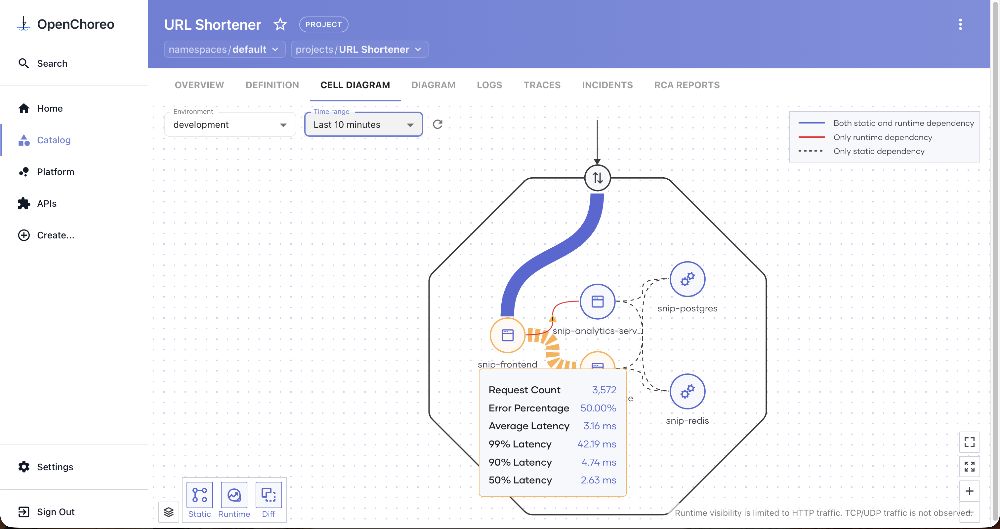

# Networking Module with Cilium

|               |                                                                                                                                                                              |
| ------------- | ---------------------------------------------------------------------------------------------------------------------------------------------------------------------------- |
| Code coverage | [](https://codecov.io/gh/openchoreo/community-modules) |

This module enables advanced network security and observability in OpenChoreo using [Cilium](https://cilium.io/).

## Features

### Advanced network security

- Project boundary isolation in runtime using `CiliumNetworkPolicies`
- Egress control based on FQDN, HTTP paths, etc (Coming Soon)

### Advanced network observability

- HTTP throughput and latency metrics
  

- Cell Diagram runtime observability
  

- Network wirelogs (Coming Soon)

## Prerequisites

- [Cilium](https://cilium.io/) must be installed on the dataplane Kubernetes clusters and configured as the Container Network Interface (CNI) plugin.
- [OpenChoreo](https://openchoreo.dev) must be installed with the **observability plane** enabled and with [observability-metrics-prometheus](https://github.com/openchoreo/community-modules/tree/main/observability-metrics-prometheus) community module installed if you want network observability.

## Configuration

1. After the prerequisites are met, configure your Cilium installation in the dataplane Kubernetes cluster with the following values (using the Cilium CLI or Helm chart) to enable HTTP metrics observability.

```yaml
hubble:
  enabled: true
  metrics:
    enabled:
      - "httpV2:exemplars=true;labelsContext=source_ip,source_namespace,source_workload,destination_ip,destination_namespace,destination_workload,traffic_direction,source_pod,destination_pod"
      - dns
      - drop
      - tcp
    serviceMonitor:
      enabled: false

envoy:
  enabled: true
```

2. Add the annotation `openchoreo.dev/networkpolicyprovider: cilium` to the `DataPlane` or `ClusterDataPlane` resources which points to the kubernetes cluster with Cilium configured.

Example:

```bash
kubectl annotate clusterdataplanes.openchoreo.dev default openchoreo.dev/networkpolicyprovider=cilium --overwrite
```

## Verification

Verify that the annotation has correctly been set in the `DataPlane`/`ClusterDataPlane` resources.

Example:

```bash
kubectl describe clusterdataplanes.openchoreo.dev default | grep "openchoreo.dev/networkpolicyprovider"
```

Verify if `CiliumNetworkPolicy` resources are generated instead of `NetworkPolicy` resources in dataplane cluster

Example:

```bash
kubectl get ciliumnetworkpolicies.cilium.io -A
```

## Compatibility

This module integrates Cilium, OpenChoreo, and observability-metrics-prometheus (an OpenChoreo community module), and is compatible with the following versions.

- Cilium Version: 1.19.x
- OpenChoreo Version: 1.1.x
- Observability-Metrics-Prometheus Module Version: 0.6.x
