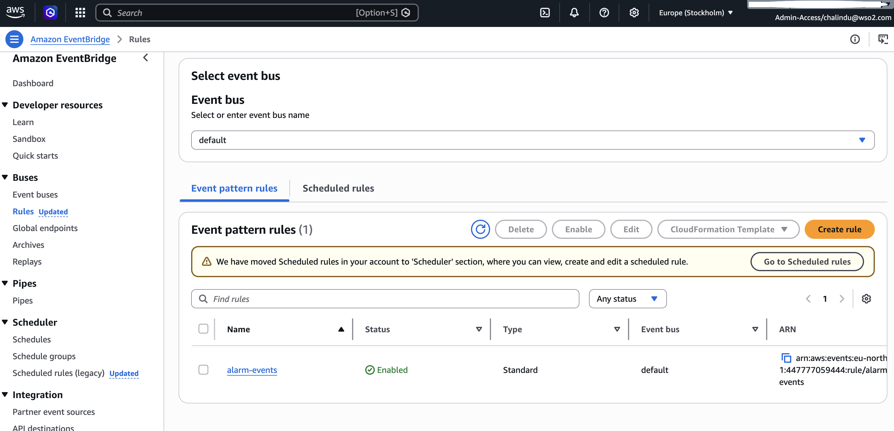
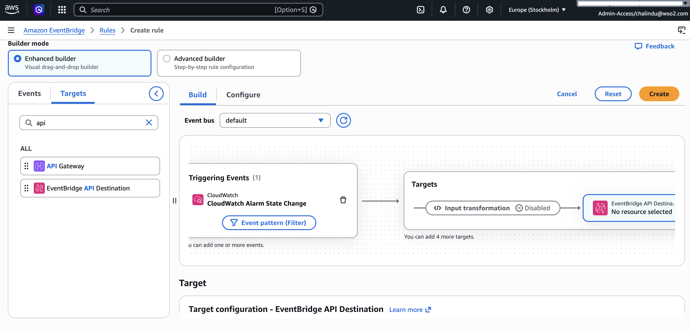
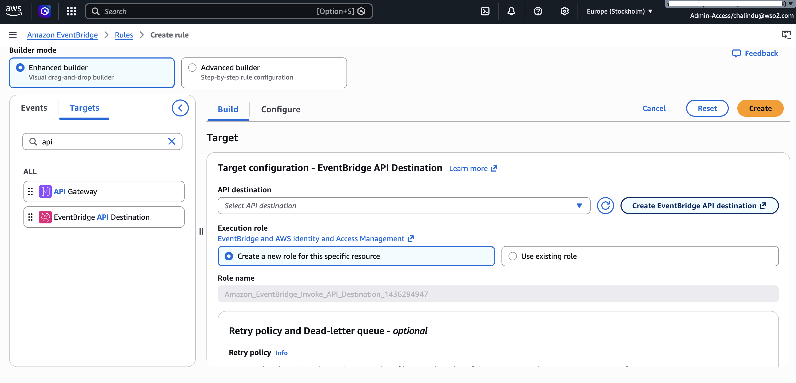
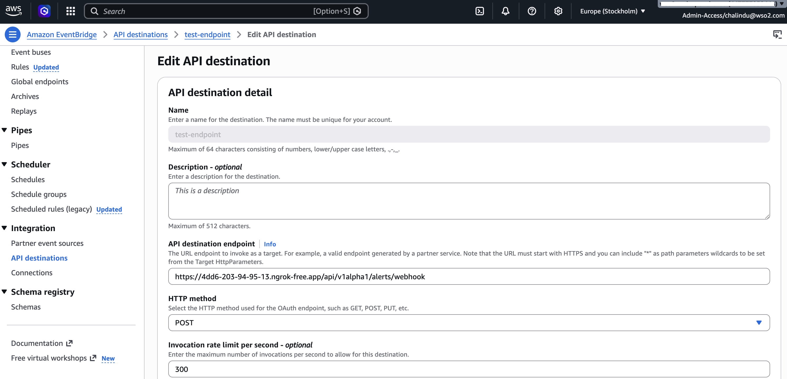
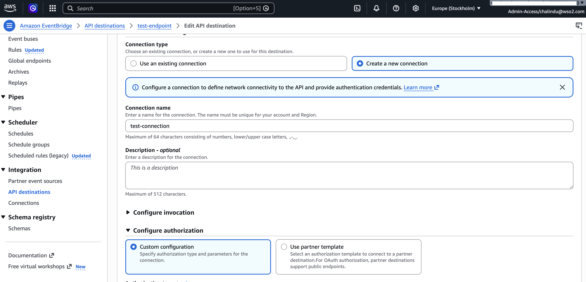
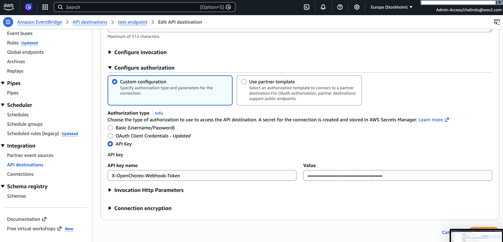
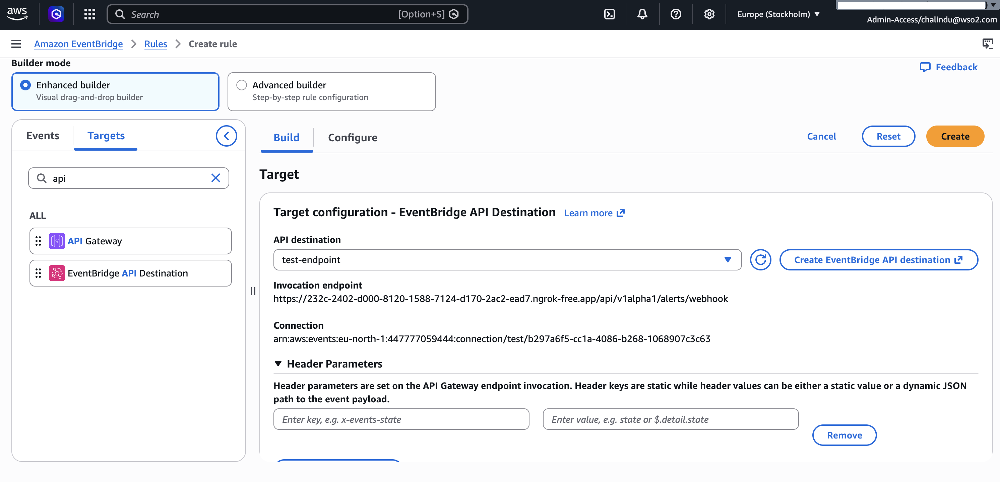

# Observability Logs Module for AWS CloudWatch

|               |           |
| ------------- | --------- |
| Code coverage | [](https://codecov.io/gh/openchoreo/community-modules) |

The **Observability Logs Module for AWS CloudWatch** sends OpenChoreo container logs to **AWS CloudWatch Logs** and exposes them back to the OpenChoreo Observer through the standard **OpenChoreo CloudWatch Adapter API**. It also supports log-based alerting by translating OpenChoreo alert rules into **CloudWatch Logs metric filters** and **CloudWatch metric alarms**.

This module supports both:

- **EKS clusters** using **EKS Pod Identity** — recommended for production.
- **Non-EKS Kubernetes clusters** such as **k3d**, **kind**, or Kubernetes running outside AWS, using static AWS credentials.

## Table of contents

1. [Architecture](#architecture)
2. [Prerequisites](#prerequisites)
3. [IAM permissions](#iam-permissions)
4. [Installation on EKS with Pod Identity](#installation-on-eks-with-pod-identity)
5. [Installation on non-EKS clusters with static credentials](#installation-on-non-eks-clusters-with-static-credentials)
6. [Wire the Observer to the adapter](#wire-the-observer-to-the-adapter)
7. [Verify log ingestion and querying](#verify-log-ingestion-and-querying)
8. [Enable log alerting](#enable-log-alerting)
9. [Expose the alert webhook through EventBridge](#expose-the-alert-webhook-through-eventbridge)
10. [Configuration reference](#configuration-reference)
11. [k3d and kind compatibility](#k3d-and-kind-compatibility)
12. [Troubleshooting](#troubleshooting)

## Architecture

This module has two main responsibilities:

1. **Log ingestion and query**
2. **Alerting**

The upstream [`amazon-cloudwatch-observability`](https://github.com/aws-observability/helm-charts) chart deploys the **CloudWatch Agent** and **Fluent Bit** cluster-wide. Application logs are written to the following CloudWatch log group:

```text
/aws/containerinsights/<clusterName>/application
```

Each log record includes Kubernetes metadata such as:

- Namespace
- Pod name
- Container name
- Labels

The CloudWatch adapter is a small Go service that implements the OpenChoreo Logs Adapter API.

| Endpoint | Purpose |
| --- | --- |
| `POST /api/v1/logs/query` | Runs a CloudWatch Logs Insights query and filters logs by OpenChoreo scope labels. |
| `POST /api/v1alpha1/alerts/rules` | Creates a CloudWatch Logs metric filter and CloudWatch metric alarm. |
| `GET /api/v1alpha1/alerts/rules/{ruleName}` | Gets the alert rule identified by `{ruleName}`. |
| `PUT /api/v1alpha1/alerts/rules/{ruleName}` | Updates the alert rule identified by `{ruleName}`. |
| `DELETE /api/v1alpha1/alerts/rules/{ruleName}` | Deletes the metric filter and alarm for the alert rule identified by `{ruleName}`. |
| `POST /api/v1alpha1/alerts/webhook` | Receives forwarded CloudWatch alarm events from EventBridge and forwards them to the Observer. |
| `GET /healthz` | Readiness check. Returns `200` once the adapter is ready. |
| `GET /livez` | Liveness check. Does not call AWS, so transient AWS or DNS issues do not crash-loop the pod. |

## Prerequisites

Before installing this module, make sure the following are available.

### OpenChoreo prerequisites

- OpenChoreo is installed.
- The `openchoreo-observability-plane` Helm chart is installed.

See the [OpenChoreo documentation](https://openchoreo.dev/docs) for the base installation steps.

### Local tooling

Install the following tools on your machine:

- `helm`
- `kubectl`
- `jq`
- `aws` CLI v2

### AWS prerequisites

You need:

- An AWS account.
- An AWS region, for example `us-east-1`.
- A cluster name, for example `openchoreo-dev`.
- An IAM principal with the permissions described in [IAM permissions](#iam-permissions).

For EKS, use an IAM role with **EKS Pod Identity**. For non-EKS clusters such as k3d or kind, use an IAM user with access keys.

## IAM permissions

The CloudWatch adapter needs permissions for three paths:

1. Startup identity check.
2. Log query and metric-filter management.
3. CloudWatch alarm management.

The CloudWatch Agent and Fluent Bit also need permission to write logs to CloudWatch. Attach the AWS-managed policy below to the same IAM principal used by the agent path:

```text
CloudWatchAgentServerPolicy
```

### Adapter IAM policy

Create the following custom IAM policy and attach it to the adapter IAM principal.

Replace:

- `<region>` with your AWS region.
- `<account-id>` with your AWS account ID.
- `<cluster-name>` with your CloudWatch cluster name.

```json
{
  "Version": "2012-10-17",
  "Statement": [
    {
      "Sid": "Startup",
      "Effect": "Allow",
      "Action": "sts:GetCallerIdentity",
      "Resource": "*"
    },
    {
      "Sid": "LogsScoped",
      "Effect": "Allow",
      "Action": [
        "logs:StartQuery",
        "logs:PutMetricFilter",
        "logs:DescribeMetricFilters",
        "logs:DeleteMetricFilter"
      ],
      "Resource": "arn:aws:logs:<region>:<account-id>:log-group:/aws/containerinsights/<cluster-name>/application:*"
    },
    {
      "Sid": "LogsUnscoped",
      "Effect": "Allow",
      "Action": [
        "logs:GetQueryResults",
        "logs:StopQuery"
      ],
      "Resource": "*"
    },
    {
      "Sid": "MetricAlarms",
      "Effect": "Allow",
      "Action": [
        "cloudwatch:PutMetricAlarm",
        "cloudwatch:DescribeAlarms",
        "cloudwatch:DeleteAlarms",
        "cloudwatch:TagResource",
        "cloudwatch:ListTagsForResource"
      ],
      "Resource": "*"
    }
  ]
}
```

Notes:

- `logs:GetQueryResults` and `logs:StopQuery` do not support resource-level permissions, so they must use `"Resource": "*"`.
- `cloudwatch:TagResource` is required because the adapter adds tags when creating alarms.
- `cloudwatch:UntagResource` is not required because the adapter does not remove tags.
- CloudWatch alarm actions use `"Resource": "*"` because alarm ARNs are only known after the first `PutMetricAlarm` call.
- Leave `adapter.alerting.alarmActionArns` empty when using EventBridge to forward alarm state-change events.

## Installation on EKS with Pod Identity

This is the recommended installation path for EKS clusters.

### Step 1 — Export shared values

```bash
export AWS_REGION=us-east-1
export CLUSTER_NAME=openchoreo-dev
export NS=openchoreo-observability-plane
export WEBHOOK_SHARED_SECRET="$(openssl rand -base64 32)"
```

Make sure your `kubectl` context points to the target EKS cluster:

```bash
kubectl config current-context
```

Also verify that the EKS Pod Identity Agent add-on is installed:

```bash
kubectl -n kube-system get ds eks-pod-identity-agent
```

Pod Identity credentials are injected only when the Pod Identity Agent is running.

### Step 2 — Create the IAM role

Create one IAM role, for example:

```text
openchoreo-cloudwatch-eks-role
```

Attach both of the following policies to the role:

- The custom [Adapter IAM policy](#adapter-iam-policy).
- The AWS-managed `CloudWatchAgentServerPolicy`.

Use the following trust policy:

```json
{
  "Version": "2012-10-17",
  "Statement": [
    {
      "Effect": "Allow",
      "Principal": {
        "Service": "pods.eks.amazonaws.com"
      },
      "Action": [
        "sts:AssumeRole",
        "sts:TagSession"
      ]
    }
  ]
}
```

### Step 3 — Install the module

```bash
helm upgrade --install observability-logs-cloudwatch \
  oci://ghcr.io/openchoreo/helm-charts/observability-logs-cloudwatch \
  --create-namespace \
  --namespace "$NS" \
  --version 0.1.0 \
  --set amazon-cloudwatch-observability.clusterName="$CLUSTER_NAME" \
  --set amazon-cloudwatch-observability.region="$AWS_REGION" \
  --set adapter.alerting.webhookAuth.enabled=true \
  --set adapter.alerting.webhookAuth.sharedSecret="$WEBHOOK_SHARED_SECRET"
```

### Step 4 — Create Pod Identity associations

Create three Pod Identity associations in the `$NS` namespace. All three should point to the same IAM role created in the previous step.

| ServiceAccount | Used by |
| --- | --- |
| `logs-adapter-cloudwatch` | Adapter queries, alerting CRUD, and webhook handling. |
| `cloudwatch-setup` | Setup Job that creates log groups and applies retention. |
| `cloudwatch-agent` | CloudWatch Agent and Fluent Bit DaemonSets. |

You can create these associations from the AWS Console:

```text
EKS → Cluster → Access → Pod Identity associations → Create
```

### Step 5 — Restart workloads if associations were created late

EKS Pod Identity injects credentials only at pod creation time.

So, you will see errors such as:

- `AccessDeniedException` from `assumed-role/<node-role>` in Fluent Bit or CloudWatch Agent logs.
- `Unable to locate credentials` in the `cloudwatch-setup-logs` Job.

Recreate the workloads so new pods receive Pod Identity credentials:

```bash
kubectl -n "$NS" rollout restart ds/cloudwatch-agent
kubectl -n "$NS" rollout restart ds/fluent-bit
kubectl -n "$NS" rollout restart deploy/logs-adapter-cloudwatch

# Re-trigger the setup Helm hook (it ran once at install time)
kubectl -n $NS delete job cloudwatch-setup-logs --ignore-not-found
helm upgrade observability-logs-cloudwatch \
  oci://ghcr.io/openchoreo/helm-charts/observability-logs-cloudwatch \
  --namespace $NS --reuse-values
```

Verify that Pod Identity was injected into a new Fluent Bit pod:

```bash
kubectl -n "$NS" get pod -l k8s-app=fluent-bit -o name | head -1 \
  | xargs -I {} kubectl -n "$NS" get {} -o yaml \
  | grep -E "AWS_CONTAINER|eks-pod-identity-token"
```

If these values are missing, check that the namespace and ServiceAccount names in the Pod Identity associations exactly match the table above.

## Installation on non-EKS clusters with static credentials

Use this path for:

- k3d
- kind
- Kubernetes clusters outside AWS
- Kubernetes clusters where Pod Identity or IRSA is not available

In this mode, the chart creates a Kubernetes Secret containing AWS credentials. The adapter reads this Secret, and a post-install hook patches Fluent Bit to consume the same credentials.

### Step 1 — Export shared values

```bash
export AWS_REGION=us-east-1
export CLUSTER_NAME=openchoreo-dev
export NS=openchoreo-observability-plane
export WEBHOOK_SHARED_SECRET="$(openssl rand -base64 32)"
export AWS_ACCESS_KEY_ID="AKIA..."
export AWS_SECRET_ACCESS_KEY="..."
```

### Step 2 — Create an IAM user

Create an IAM user and attach both:

- The custom [Adapter IAM policy](#adapter-iam-policy).
- The AWS-managed `CloudWatchAgentServerPolicy`.

Create access keys for this IAM user and export them as shown above.

### Step 3 — Install the module

```bash
helm upgrade --install observability-logs-cloudwatch \
  oci://ghcr.io/openchoreo/helm-charts/observability-logs-cloudwatch \
  --create-namespace \
  --namespace "$NS" \
  --version 0.1.0 \
  --set amazon-cloudwatch-observability.clusterName="$CLUSTER_NAME" \
  --set amazon-cloudwatch-observability.region="$AWS_REGION" \
  --set awsCredentials.create=true \
  --set awsCredentials.name=cloudwatch-aws-credentials \
  --set awsCredentials.accessKeyId="$AWS_ACCESS_KEY_ID" \
  --set awsCredentials.secretAccessKey="$AWS_SECRET_ACCESS_KEY" \
  --set cloudWatchAgent.injectAwsCredentials.enabled=true \
  --set adapter.alerting.webhookAuth.enabled=true \
  --set adapter.alerting.webhookAuth.sharedSecret="$WEBHOOK_SHARED_SECRET"
```

This enables the static-credentials path:

- The chart creates a Kubernetes Secret.
- The adapter reads credentials from that Secret.
- The post-install hook patches the upstream Fluent Bit DaemonSet to use the same Secret.

You do not need to restart workloads after installation because credentials are injected during install.

## Wire the Observer to the adapter

After installing the CloudWatch module, configure the OpenChoreo Observer to call this adapter.

```bash
helm upgrade --install openchoreo-observability-plane \
  oci://ghcr.io/openchoreo/helm-charts/openchoreo-observability-plane \
  --version 1.0.1-hotfix.1 \
  --namespace "$NS" \
  --reuse-values \
  --set observer.logsAdapter.enabled=true
```

After this step, the OpenChoreo Observer uses the CloudWatch adapter for log queries.

## Verify log ingestion and querying

### Step 1 — Check pod status

```bash
kubectl -n "$NS" rollout status deploy/logs-adapter-cloudwatch
kubectl -n "$NS" get pods
```

Confirm that the following workloads are running:

- `logs-adapter-cloudwatch`
- `cloudwatch-agent`
- `fluent-bit`

### Step 2 — Check adapter health

```bash
kubectl -n "$NS" port-forward svc/logs-adapter 9098:9098 &
curl -sf http://localhost:9098/healthz | jq .
```

Expected response:

```json
{
  "status": "healthy"
}
```

AWS credentials are checked during adapter startup. If the adapter starts successfully, most credential or STS issues have already been caught.

### Step 3 — Run a smoke test

Create a temporary pod that writes ten log lines. The pod includes synthetic OpenChoreo labels so the adapter scope filter can match it.

```bash
kubectl run cloudwatch-smoke-test --rm -i --restart=Never \
  --labels='openchoreo.dev/namespace=default,openchoreo.dev/component-uid=smoke-test' \
  --image=busybox:1.36 \
  -- sh -c 'for i in 1 2 3 4 5 6 7 8 9 10; do echo "smoke-test line $i $(date -Iseconds)"; sleep 1; done'
```

Wait for Fluent Bit to batch and ship the logs:

```bash
sleep 60
```

Query the adapter:

```bash
curl -s http://localhost:9098/api/v1/logs/query \
  -H 'Content-Type: application/json' \
  -d '{
    "startTime": "'"$(date -u -v-15M +%FT%TZ 2>/dev/null || date -u -d '-15 minutes' +%FT%TZ)"'",
    "endTime": "'"$(date -u +%FT%TZ)"'",
    "limit": 20,
    "sortOrder": "desc",
    "searchScope": {
      "namespace": "default",
      "componentUid": "smoke-test"
    }
  }' | jq '{total, tookMs, firstLog: (.logs[0] // null)}'
```

Expected result:

```json
{
  "total": 10,
  "tookMs": 123,
  "firstLog": {
    "...": "..."
  }
}
```

The exact `tookMs` value will vary.

If `total` remains `0` after waiting another minute, the problem is usually in the ingestion path rather than the adapter. Check [Troubleshooting](#troubleshooting).

## Enable log alerting

Enable alerting after the base log query path is working.

```bash
helm upgrade observability-logs-cloudwatch \
  oci://ghcr.io/openchoreo/helm-charts/observability-logs-cloudwatch \
  --namespace "$NS" \
  --reuse-values \
  --set adapter.alerting.enabled=true
```

If `adapter.alerting.webhookAuth.enabled=true` and `adapter.alerting.webhookAuth.sharedSecret` were set during installation, the adapter now requires the following header on alert webhook calls:

```text
X-OpenChoreo-Webhook-Token
```

## Expose the alert webhook through EventBridge

CloudWatch alarms cannot directly send HTTP requests to the adapter. To deliver alarm events, use EventBridge:

```text
CloudWatch Alarm State Change
    |
    v
EventBridge Rule
    |
    v
EventBridge API Destination
    |
    v
/api/v1alpha1/alerts/webhook
    |
    v
CloudWatch Logs Adapter
    |
    v
OpenChoreo Observer
```

For production, expose only the alert webhook endpoint:

```text
/api/v1alpha1/alerts/webhook
```

Do **not** publicly expose:

- `/api/v1/logs/query`
- `/api/v1alpha1/alerts/rules/*`
- `/healthz`
- `/livez`

Use `adapter.alerting.webhookRoute` to create a Gateway API `HTTPRoute` that exposes only the webhook path through your existing Gateway. TLS termination, rate limiting, and any WAF / auth rules belong on the parent Gateway listener.

### Development-only webhook test with port-forward and ngrok

For local testing, you can expose the adapter through a temporary public tunnel.

Start a port-forward:

```bash
kubectl -n "$NS" port-forward svc/logs-adapter 19098:9098 &
```

Start an ngrok tunnel:

```bash
ngrok http 19098
```

Set the public webhook URL:

```bash
export ADAPTER_WEBHOOK_PUBLIC_URL=https://<ngrok-host>/api/v1alpha1/alerts/webhook
```

Then create an EventBridge connection, API destination, and rule that sends CloudWatch alarm state-change events to that URL with the `X-OpenChoreo-Webhook-Token` header.

1. Go to EventBridge Rules.

   

2. Attach Event and Target.

   

3. Add an API Destination as the target.

   

4. Create the API Destination.

   

5. Create a Connection for the API Destination.

   

6. Add the `X-OpenChoreo-Webhook-Token` API key header to the Connection.

   

7. Finish creating the rule and select the API Destination.

   

### Test alert delivery

Follow the URL Shortener sample to generate alert-worthy logs:

```text
https://github.com/openchoreo/openchoreo/tree/main/samples/from-image/url-shortener
```

Then check the adapter logs:

```bash
kubectl -n "$NS" logs deploy/logs-adapter-cloudwatch --tail=100 | grep -Ei 'webhook|forward'
```

Expected log messages should show that the webhook was received and forwarded to the Observer.

## Alerting behavior

The module implements log alerts using native CloudWatch resources:

1. A CloudWatch Logs metric filter on `/aws/containerinsights/<clusterName>/application`.
2. A custom CloudWatch metric in `adapter.alerting.metricNamespace`.
3. A CloudWatch metric alarm for that custom metric.
4. An EventBridge rule that forwards CloudWatch alarm state changes to the adapter webhook.

Important constraints:

- Metric filters evaluate only newly ingested log events. They do not backfill historical logs.
- `source.query` in the trait uses **CloudWatch Logs filter-pattern syntax**.

### Alert identity mapping

The adapter stores the logical OpenChoreo rule identity in CloudWatch alarm tags:

- `openchoreo.rule.name`
- `openchoreo.rule.namespace`

The adapter also encodes the rule identity into the alarm name for fast lookup.

Managed alarm names use this format:

```text
oc-logs-alert-ns.<namespace>.rn.<name>.<hash>
```

`<namespace>` and `<name>` are base64url-encoded without padding.

## Shared webhook secret

When webhook authentication is enabled, the adapter rejects webhook requests that do not include the configured token in this header:

```text
X-OpenChoreo-Webhook-Token
```

The same token must be configured in the EventBridge API destination connection.

### Option 1 — Inline secret

This is convenient for development:

```bash
--set adapter.alerting.webhookAuth.enabled=true \
--set adapter.alerting.webhookAuth.sharedSecret="$WEBHOOK_SHARED_SECRET"
```

However, the secret becomes visible in Helm release values. Anyone with access to `helm get values` may be able to read it.

### Option 2 — Existing Kubernetes Secret

This is recommended for production.

Create the Secret:

```bash
kubectl -n "$NS" create secret generic openchoreo-webhook-token \
  --from-literal=token="$WEBHOOK_SHARED_SECRET"
```

Point the chart to the Secret:

```bash
helm upgrade observability-logs-cloudwatch \
  oci://ghcr.io/openchoreo/helm-charts/observability-logs-cloudwatch \
  --namespace "$NS" \
  --reuse-values \
  --set adapter.alerting.webhookAuth.enabled=true \
  --set adapter.alerting.webhookAuth.sharedSecret="" \
  --set adapter.alerting.webhookAuth.sharedSecretRef.name=openchoreo-webhook-token \
  --set adapter.alerting.webhookAuth.sharedSecretRef.key=token
```

Pass `sharedSecret=""` when switching from inline secret to Secret reference. Otherwise, the previous inline value may continue to shadow the Secret reference.

## Configuration reference

| Value | Default | Description |
| --- | --- | --- |
| `amazon-cloudwatch-observability.clusterName` | Required | Cluster segment in the CloudWatch log group path. Used by the upstream subchart and this adapter. |
| `amazon-cloudwatch-observability.region` | Required | AWS region for CloudWatch log groups and API calls. |
| `logGroupPrefix` | `/aws/containerinsights` | Prefix shared by application, dataplane, and host log groups. |
| `awsCredentials.create` | `false` | Creates a static AWS credentials Secret. Keep `false` for Pod Identity, IRSA, or instance-profile based auth. Set to `true` for k3d, kind, or non-EKS clusters. |
| `awsCredentials.name` | `""` | Name of the AWS credentials Secret. Required when `awsCredentials.create=true`. |
| `awsCredentials.accessKeyId` | Required if `create=true` | AWS access key ID. |
| `awsCredentials.secretAccessKey` | Required if `create=true` | AWS secret access key. |
| `containerLogs.retentionDays` | `7` | Retention period applied to log groups created by the setup Job. |
| `cloudWatchAgent.enabled` | `true` | Enables the upstream `amazon-cloudwatch-observability` subchart. |
| `cloudWatchAgent.bridgeService.enabled` | `true` | Creates an ExternalName Service from `amazon-cloudwatch/cloudwatch-agent` to the real Service. Useful when installing outside the `amazon-cloudwatch` namespace. |
| `cloudWatchAgent.injectAwsCredentials.enabled` | `false` | Patches Fluent Bit to consume static AWS credentials. Enable this with `awsCredentials.create=true` for non-EKS clusters. |
| `cloudWatchAgent.hookImage.repository` | `alpine/k8s` | Image used by the post-install hook Job. |
| `cloudWatchAgent.hookImage.tag` | `1.30.0` | Tag used by the post-install hook Job. |
| `setup.enabled` | `true` | Runs the setup Job that creates log groups and applies retention. |
| `adapter.enabled` | `true` | Deploys the CloudWatch Logs Adapter Deployment and Service. |
| `adapter.queryTimeoutSeconds` | `30` | Maximum duration for each CloudWatch Logs Insights query. |
| `adapter.queryPollMilliseconds` | `500` | Poll interval for `get_query_results`. |
| `adapter.alerting.enabled` | `false` | Enables alert rule CRUD and webhook forwarding. |
| `adapter.alerting.metricNamespace` | `OpenChoreo/Logs` | CloudWatch metric namespace for metrics emitted from metric filters. |
| `adapter.alerting.alarmActionArns` | `[]` | Optional alarm action ARNs. Leave empty when using EventBridge. |
| `adapter.alerting.okActionArns` | `[]` | Optional OK-state action ARNs. |
| `adapter.alerting.insufficientDataActionArns` | `[]` | Optional insufficient-data action ARNs. |
| `adapter.alerting.observerUrl` | `http://observer-internal:8081` | Base URL of the Observer used when forwarding webhook events. |
| `adapter.alerting.forwardRecovery` | `false` | Forward `OK` and `INSUFFICIENT_DATA` transitions in addition to `ALARM`. |
| `adapter.alerting.webhookAuth.enabled` | `false` | Requires the shared webhook token. |
| `adapter.alerting.webhookAuth.sharedSecret` | `""` | Inline shared secret for webhook authentication. Suitable for development only. |
| `adapter.alerting.webhookAuth.sharedSecretRef.name` | `""` | Existing Kubernetes Secret name containing the webhook token. Recommended for production. |
| `adapter.alerting.webhookAuth.sharedSecretRef.key` | `token` | Key inside the existing Secret. |
| `adapter.alerting.webhookRoute.enabled` | `false` | Creates a Gateway API `HTTPRoute` exposing only `/api/v1alpha1/alerts/webhook`. |
| `adapter.alerting.webhookRoute.parentRef.name` | `gateway-default` | Name of the Gateway to attach to. |
| `adapter.alerting.webhookRoute.parentRef.namespace` | `""` | Namespace of the Gateway. Empty defaults to the release namespace. |
| `adapter.alerting.webhookRoute.parentRef.sectionName` | `""` | Optional listener `sectionName` on the Gateway. |
| `adapter.alerting.webhookRoute.hostnames` | `[]` | Optional hostnames matched at the route level. Empty inherits the listener hostname. |
| `adapter.networkPolicy.enabled` | `false` | Creates a NetworkPolicy for adapter ingress traffic. |
| `adapter.networkPolicy.observerNamespaceLabels` | `{kubernetes.io/metadata.name: openchoreo-observability-plane}` | Namespace labels allowed to call the adapter from the Observer. |
| `adapter.networkPolicy.observerPodLabels` | `{}` | Pod labels allowed to call the adapter from the Observer. Tune per deployment. |
| `adapter.networkPolicy.gatewayNamespaceLabels` | `{}` | Namespace labels of the Gateway data-plane pods allowed to proxy the webhook. Set when `webhookRoute` is enabled. |
| `adapter.networkPolicy.allowProbeIPBlock` | `""` | Optional node CIDR for kubelet probes when required by the CNI. |

## k3d and kind compatibility

### 1. Static credential injection

The upstream Fluent Bit DaemonSet does not expose a simple value for static AWS credentials.

This module includes a post-install hook that patches Fluent Bit to consume the same AWS credentials Secret used by the adapter.

### 2. Missing systemd journal

k3d and kind nodes do not have a systemd journal at:

```text
/var/log/journal
```

The upstream Fluent Bit configuration can crash-loop while trying to tail it. This module overrides the dataplane and host log configs with no-op files by default.

### 3. Required labels and annotations

The adapter filters logs by OpenChoreo labels. The upstream application log config disables labels and annotations by default.

This module ships an adjusted `application-log.conf` with labels enabled, so records include values such as:

```text
openchoreo.dev/component-uid
openchoreo.dev/environment-uid
openchoreo.dev/project-uid
```

### 4. IMDS timeouts outside AWS

The upstream Application Signals enrichment path can call the EC2 Instance Metadata Service at:

```text
169.254.169.254
```

In k3d or kind, that endpoint does not exist. Each call can time out and block log delivery.

This module disables the enrichment path for non-EKS compatibility by default:

- Drops the `[FILTER] aws` block.
- Sets `Use_Pod_Association Off`.
- Sets `add_entity false`.

EKS users who want Application Signals entity enrichment can re-enable the upstream configuration from the `amazon-cloudwatch-observability` chart.

### 5. CloudWatch Agent credentials

The static credential hook patches the `fluent-bit` DaemonSet, but it does not patch the `cloudwatch-agent` DaemonSet.

On k3d or kind, the agent may log errors such as:

```text
SharedCredsLoad: failed to load shared credentials file
```

This affects Container Insights metrics, but it does not affect the log query or alerting path, which uses Fluent Bit and the adapter.

If you need Container Insights metrics on a non-IRSA cluster, patch the `AmazonCloudWatchAgent` custom resource to inject the same Secret.

## Troubleshooting

### Start with these logs

```bash
kubectl -n "$NS" logs ds/fluent-bit --tail=200
kubectl -n "$NS" logs deploy/logs-adapter-cloudwatch --tail=200
kubectl -n "$NS" logs job/cloudwatch-agent-post-install --tail=200
```

### Common issues

| Symptom | Likely cause | What to check |
| --- | --- | --- |
| Adapter pod does not start | Missing or invalid AWS credentials | Check Pod Identity association or static Secret values. |
| Fluent Bit shows `AccessDeniedException` | Pod is using the node IAM role instead of Pod Identity role | Restart Fluent Bit after creating Pod Identity associations. |
| Setup Job shows `Unable to locate credentials` | Pod Identity association missing or static Secret not configured | Check the `cloudwatch-setup` ServiceAccount association or static credentials values. |
| Query returns `total: 0` | Logs not shipped to CloudWatch, or labels are missing | Check Fluent Bit logs and verify that labels are enabled in log records. |
| Fluent Bit logs `no upstream connections available` | CloudWatch Agent Service namespace mismatch | Check that `cloudWatchAgent.bridgeService.enabled=true`. |
| Fluent Bit is healthy but no logs arrive | IMDS/entity enrichment timeout on k3d/kind | Confirm that Application Signals entity enrichment is disabled for non-EKS clusters. |
| Webhook returns unauthorized | Missing or incorrect `X-OpenChoreo-Webhook-Token` | Check EventBridge connection header and chart webhook secret values. |
| Alerts do not fire for old logs | CloudWatch metric filters do not backfill | Generate new matching logs after creating the rule. |
